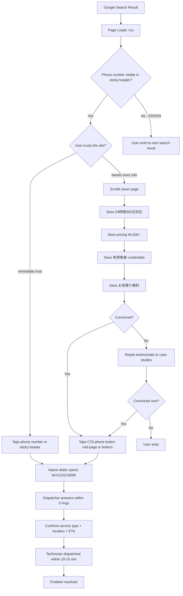
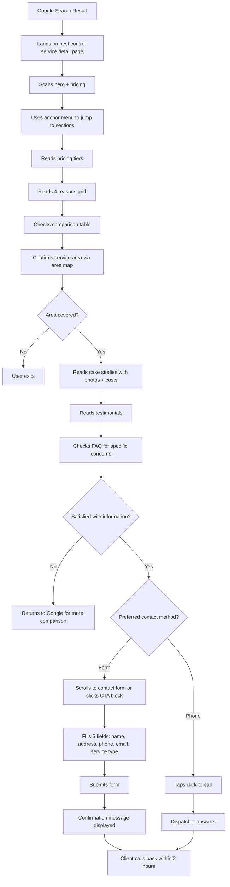
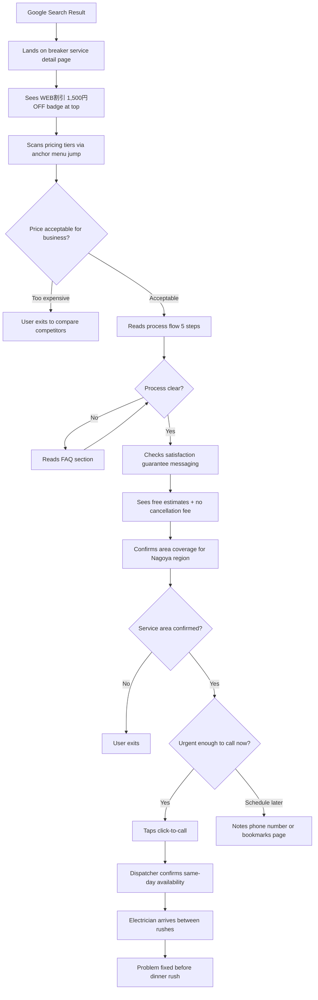
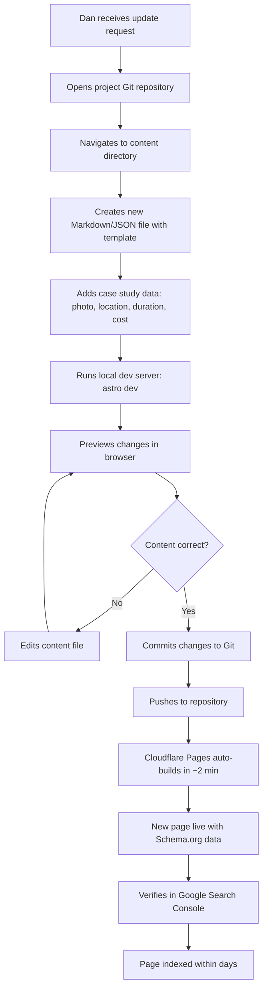

# UX Design Specification star-light

**Author:** Luonghailam
**Date:** 2026-05-07

---

## Executive Summary

### Project Vision

A pixel-perfect clone of star-light15.net (設備人/Setsubit) — a Japanese home repair service website serving four regions: Tokyo, Nagoya, Osaka, and Hyogo with three service categories: water repair, electrical repair, and pest control. The goal is 100% visual and functional replication of the original site's design, layout, animations, and architecture while achieving superior technical performance through Astro SSG on Cloudflare Pages. Every page, component, interaction pattern, and visual detail must match the source site exactly — clone the proven UX logic, then outperform technically.

### Target Users

1. **Emergency homeowners** (Tanaka-san archetype) — Panicked, searching at 2 AM on mobile for immediate water/electrical repair. Need: instant page load (<1s), prominent click-to-call (0120-219-695), 24/7 messaging, trust signals. Has 8 seconds to decide whether to call.

2. **Research-mode consumers** (Suzuki-san archetype) — Comparing pest control options during lunch break on mobile. Need: detailed service pages with anchor link navigation, case studies with photos/cost/duration, FAQ, transparent pricing, contact form with service category selection.

3. **Business owners** (Yamamoto-san archetype) — Commercial clients (e.g., ramen shop owner) needing same-day electrical repair during business hours. Need: process flow clarity (5-step), satisfaction guarantee ("no charge if unsatisfied"), professional credibility, same-day messaging.

4. **Content manager** (Dan archetype) — Non-technical staff updating content via Markdown/JSON files. Need: simple workflow, local preview, fast deployment, schema-driven content with validation to avoid manual errors across 12+ page variants.

**Demographics:** Japanese homeowners and business owners across Tokyo, Nagoya, Osaka, Hyogo. Skews older (40-60), moderate tech literacy, mobile-dominant (iOS heavy in Japan).

### Key Design Challenges

1. **Pixel-perfect replication** — Must match the original site's visual identity exactly: color scheme (white background, navy/dark accents, orange CTAs), typography (Noto Sans JP), spacing, card layouts, section ordering, and CTA patterns. No creative interpretation — faithful clone of proven conversion patterns.

2. **CTA density is intentional, not accidental** — Phone number appears 5+ times per page. This is a deliberate Japanese emergency service UX pattern: panicked users do not scroll back up. The number must be visible wherever they are on the page. Implement with sticky mobile CTA bar without changing the information architecture.

3. **Japanese typography precision** — Noto Sans JP full font is 3MB+. Requires unicode-range subsetting (~200KB) or Google Fonts with preconnect. Word-break rules (keep-all for Japanese text), proper line-breaking, and CLS management during font swap are critical.

4. **Trust signal ordering preserves conversion funnel** — Japanese users follow a specific psychological sequence: (1) Do they serve my area? → (2) Are they credible? (licenses, certifications) → (3) Is pricing fair? → (4) What do others say? (testimonials). Reordering sections for aesthetics would break this proven funnel.

5. **Multi-page consistency at scale** — 3 services × 4 regions = 12+ page variants sharing identical component patterns (header, footer, CTA blocks, service cards, breadcrumbs, anchor link menus) with zero visual deviation. Data-driven page generation from content collections, not 12 separate templates.

### Design Challenges — Technical Constraints Affecting UX

- **Hero carousel LCP**: Slide 1 must be `fetchpriority="high"` + `loading="eager"`; Embla Carousel does not handle this by default
- **Sticky header + anchor menu overlap**: `scroll-margin-top` must account for combined height to prevent heading occlusion on anchor link navigation
- **Formspree + Japanese IME**: Composition events during kanji input can trigger premature form submission — requires explicit testing
- **iOS Safari sticky header**: Avoid `will-change: transform` which creates new stacking context and breaks z-index for dropdowns/overlays

### Design Opportunities

1. **Performance as invisible UX improvement** — Astro SSG on Cloudflare achieves LCP < 500ms vs the original's slower load. Same visual design, faster experience — directly improving conversion for emergency users who cannot wait.

2. **Structured data enrichment** — Same visual experience but with comprehensive Schema.org markup (LocalBusiness × 4 regions, Service, FAQ, Review, Breadcrumb) the original likely lacks. Competitor comparison tables rendered with structured data could appear as Google rich snippets.

3. **Accessibility layer without visual change** — Clone the visual design exactly but add proper WCAG 2.1 AA compliance: color contrast ratios, keyboard navigation, ARIA labels, `prefers-reduced-motion` for carousel, skip navigation links. Zero visual deviation, better accessibility.

4. **SEO landing page opportunity** — 3 services × 4 regions = 12 keyword cluster landing pages. The original may not fully exploit region-specific SEO (e.g., 「水漏れ 修理 名古屋」). Each page targets a distinct keyword cluster for Google Japan page 1.

### Important Risks and Considerations

- **Trust signal numbers must be real** — Do not copy "15,000 cases/year" from the original. All statistics, certifications, and testimonials must reflect the actual client's data. Copying competitor data carries legal and brand credibility risk.
- **Comparison tables require real data** — Japanese advertising law (景品表示法/Keihintōji Hō) prohibits misleading or unsubstantiated competitive comparisons. Rebuild tables with objective, verifiable criteria (price, response time, certifications).
- **WEB割引 (web discount) badge** — Functions as both a conversion incentive and an attribution tracking mechanism. Preserve this pattern but ensure the discount is real and authorized by the client.
- **Content management scalability** — 4 regions × 3 services = 12 page variants with near-identical content differing by location, phone number, and local case studies. Schema-driven content with Zod validation from day 1 prevents manual update errors in production.

## Core User Experience

### Defining Experience

The core user action is **making a phone call** (click-to-call 0120-219-695). Every element on every page serves as a path toward this single conversion event. The secondary action is contact form submission for non-emergency, research-mode users.

The original site achieves this through extreme simplicity: minimal JavaScript, no animation libraries, no scroll effects — pure HTML/CSS content delivery optimized for fast rendering and immediate information access. This simplicity is intentional and must be preserved in the clone.

### Platform Strategy

- **Mobile-first, touch-primary**: Japanese market is iOS-dominant; all interactions designed for thumb reach
- **Web-only**: No native app, no PWA, no offline capability needed
- **Static delivery**: Astro SSG on Cloudflare Pages edge network — zero server-side processing
- **Minimal JavaScript**: Only hero carousel and contact form require JS hydration (Astro Islands). Everything else is pure HTML/CSS.
- **Browser support**: Chrome, Safari (primary — iOS dominant in Japan), Edge (secondary), IE11 (graceful degradation)

### Site Architecture — Faithful Replication

**Page inventory (13+ pages):**

| Page Type | Count | URL Pattern |
|-----------|-------|-------------|
| Homepage | 1 | `/` |
| Service hub | 2 | `/electricity`, `/water` |
| Service detail | 9 | `/electricity/{service}`, `/water/{service}` |
| Process flow | 1 | `/flow` |
| Case studies | 1 | `/case` (paginated) |
| Testimonials | 1 | `/voice` (paginated) |
| Company hub | 1 | `/company` |
| Company sub-pages | 2 | `/company/philosophy`, `/company/office` |
| Contact | 1 | `/contact` |
| Privacy policy | 1 | `/privacy` |
| Blog/Column | 1 | `/column` (listing + detail pages) |

**Component patterns shared across all pages:**
- Sticky header: logo + mega-menu nav (electricity 5 subs, water 4 subs, company, flow, case, voice, column, FAQ) + phone CTA
- Footer: full sitemap navigation + phone/email CTA + copyright
- CTA blocks: phone number + "メールで無料相談" button, repeated 3-5× per page
- Breadcrumb navigation on all sub-pages

### Interaction Inventory — Complete List

The original site uses NO animation libraries and minimal JavaScript. All interactions are simple, functional, and conversion-focused:

| Interaction | Implementation | Pages |
|-------------|---------------|-------|
| Hero carousel | 3 slides, auto-rotate | Homepage only |
| Sticky header | Fixed position on scroll, logo + phone + nav | All pages |
| Mobile hamburger menu | Slide/toggle nav with nested sub-menus | All pages (mobile) |
| Mega-menu dropdowns | Hover/click dropdown for electricity (5) and water (4) sub-services | All pages (desktop) |
| Anchor link menu | Icon-based jump navigation to page sections | Service detail pages |
| FAQ accordion | Expand/collapse Q&A items | Homepage, service detail pages |
| Click-to-call | `tel:` protocol link, 5+ placements per page | All pages |
| Contact form | Single-column, service category dropdown with grouped options | Contact page, homepage |
| Card hover states | Basic hover effect on service/case/voice cards | Hub pages, homepage |
| Pagination | Numbered page navigation (1-2-3) | Case studies, testimonials |
| Filter navigation | Category filter links (electricity/water sub-types) | Case studies, testimonials |
| Smooth scroll | Anchor link smooth scrolling to sections | Service detail pages |

**Explicitly NOT present in the original (do not add):**
- No scroll-triggered animations (fade-in, slide-up, parallax)
- No counter/number counting animations
- No loading skeletons or spinners
- No image lazy loading attributes
- No back-to-top button
- No modal/popup elements
- No image zoom or lightbox on hover

### Service Detail Page — Canonical Layout

Service detail pages are the most complex template and follow this exact section order (replicate precisely):

1. Breadcrumb (TOP > Category > Service)
2. Hero image + WEB割引 (¥1,500 discount) badge
3. Anchor link icon menu (料金, 選ばれる理由, 比較, エリア, フロー, 施工事例, お客様の声, FAQ)
4. Pricing section — tiered cards with images and prices
5. Four "Reasons to Choose Us" grid (speed, free estimates, 24/7, qualified staff) with SVG icons
6. Competitor comparison table (設備人 vs A社 vs B社) — 3 columns
7. Service area map (static PNG, Kansai region) + prefecture city lists
8. Process flow (5 steps with numbered illustrations)
9. Case studies cards (linked, with photo/duration/cost)
10. Customer testimonials cards (linked, with service type/cost)
11. FAQ accordion section
12. Related services cards (other services in same category)
13. CTA block (phone + email) + Footer

### Critical Success Moments

1. **The 3-second decision** — Emergency user lands on page, sees phone number immediately in sticky header, taps to call. Page must load and render phone number within 1 second.

2. **The trust confirmation** — Research user scrolls through pricing, sees "no hidden fees" messaging, reads 2-3 testimonials, feels confident enough to submit contact form or call.

3. **The area check** — User quickly confirms their city/ward is in the service coverage area via the map section or office page.

4. **The comparison win** — User sees the competitor comparison table and concludes this service offers better value (lower price, faster response, more certifications).

### Experience Principles

1. **Phone number always visible** — On any page, at any scroll position, the user can initiate a call within 1 tap. No searching, no scrolling back up.

2. **Information before interaction** — Every CTA is preceded by trust-building content (pricing, certifications, testimonials). The site earns the right to ask for the call.

3. **Zero-decoration simplicity** — No animations, no effects, no visual flourish that doesn't directly serve conversion. Every pixel is functional. The original site's "boring" aesthetic is deliberate — it communicates reliability, not creativity.

4. **Progressive disclosure** — Homepage shows overview → Hub shows category → Detail shows everything. User controls depth.

5. **Consistent patterns breed trust** — Every service detail page follows the identical 13-section layout. Users learn the pattern once and navigate confidently across all services.

## Desired Emotional Response

### Primary Emotional Goals

The original site's emotional design serves one purpose: **convert anxiety into action** (phone call). Every emotional beat is engineered for this.

| Stage | Emotion | Design Mechanism |
|-------|---------|-----------------|
| Landing | Relief — "They can help me" | Instant phone number visibility, 24/7 messaging, fast page load |
| Scanning | Trust — "They are legitimate" | Licensed technician badges, 15,000 cases/year, certification icons |
| Evaluating | Confidence — "The price is fair" | Transparent pricing tiers, "no hidden fees" messaging, free estimates |
| Deciding | Reassurance — "Others had good experiences" | Testimonials with specific costs/durations, case study photos |
| Acting | Urgency — "I should call now" | WEB割引 discount badge, "最短10分" (10-min response), repeated CTAs |

### Emotional Journey Mapping

**Emergency user (Tanaka-san, 2 AM):**
- Arrival: Panic, anxiety → Site responds with: calm authority, immediate phone number, "24時間365日対応" (24/7/365)
- Scanning: Fear of scam/overcharge → Site responds with: transparent pricing, "no charge if unsatisfied" guarantee, licensed credentials
- Action: Hesitation → Site responds with: "最短10分で駆けつけ" (arrive in 10 min), one-tap call button
- Post-call: Relief → Dispatcher confirms technician en route

**Research user (Suzuki-san, lunch break):**
- Arrival: Curiosity, mild discomfort → Site responds with: organized service categories, clear navigation
- Exploring: Comparison-seeking → Site responds with: competitor table, pricing tiers, case studies with real costs
- Evaluating: Skepticism → Site responds with: FAQ answers, testimonials, service area confirmation
- Action: Calculated decision → Contact form with service category pre-selection

**Business owner (Yamamoto-san, between rushes):**
- Arrival: Frustration, urgency → Site responds with: same-day messaging, commercial capability signals
- Evaluating: Need for process clarity → Site responds with: 5-step process flow, "estimate before work" promise
- Action: Professional confidence → Click-to-call with clear expectation of what happens next

### Micro-Emotions

**Trust over Skepticism** — The dominant emotional axis. Japanese consumers for home services are highly skeptical of pricing and qualifications. Every design choice reinforces legitimacy:
- Specific numbers (¥1,100~, not "affordable")
- Named certifications (第1種/第2種電気工事士)
- Real case studies with photos, not stock imagery
- Payment method icons (cash, credit, bank transfer) signal established business

**Confidence over Confusion** — Users never wonder "what happens next?" The 5-step process flow (相談→訪問→見積→作業→支払) appears on every service detail page. Predictability creates confidence.

**Calm over Anxiety** — For emergency users, the site must not amplify panic. The color palette (white/navy/orange) is deliberately professional and measured — not red/urgent. Orange CTAs are warm, not aggressive.

**Emotions to actively avoid:**
- Overwhelm (from too much text) → Progressive disclosure solves this
- Doubt about pricing → "No hidden fees" messaging on every service page
- Frustration finding contact info → Phone number in 5+ locations per page
- Confusion about service area → Map + city lists on every detail page

### Design Implications

| Emotional Goal | UX Design Choice |
|---------------|-----------------|
| Instant relief | Sticky header with phone number renders within 1s LCP |
| Professional trust | Navy/white palette, no playful elements, no emojis, formal Japanese (敬語) |
| Pricing confidence | Exact yen amounts with tax-included notation (税込), not ranges or "contact for quote" |
| Social proof | Testimonials show specific service type + cost + duration — verifiable details, not vague praise |
| Urgency without panic | Orange CTAs (warm, action-oriented) not red (aggressive, alarming) |
| Process predictability | Identical 13-section layout on every service detail page |
| Area reassurance | Static map image + city-level granularity per prefecture |

### Emotional Design Principles

1. **Earn trust before asking for action** — Never place a CTA without preceding trust content. The pattern is always: information → proof → action. This is the Japanese consumer's decision sequence.

2. **Specificity creates trust** — "¥17,600" beats "affordable". "第1種電気工事士" beats "qualified". "50分" beats "quick". Japanese users trust numbers and credentials, not adjectives.

3. **Calm authority, not aggressive selling** — The navy/white/orange palette communicates "established professional service", not "desperate for your call". CTA density is high but tone is measured.

4. **Repetition is reassurance, not redundancy** — Showing the phone number 5+ times per page is not bad UX — it's emotional safety for panicked users who need to see it wherever they are on the page.

5. **Predictable structure reduces cognitive load** — Same layout across all service pages means users spend zero mental energy on navigation after their first visit. Familiarity breeds comfort.

## UX Pattern Analysis & Inspiration

### Inspiring Products Analysis

The sole inspiration source is star-light15.net (設備人/Setsubit) — the target site being cloned. Rather than looking externally, this analysis extracts the proven UX patterns already embedded in the original and categorizes them for faithful replication.

**What star-light15.net does well:**

1. **Conversion-optimized information architecture** — Every page follows a problem → solution → proof → action sequence. Users never encounter a CTA without preceding trust content. This maps to the Japanese consumer decision process (納得/nattoku — rational satisfaction before action).

2. **Aggressive but appropriate CTA density** — Phone number appears 5+ times per page. For emergency service websites, this is correct UX: users in distress do not scroll back up. The number must be where their eyes are at any given moment.

3. **Data-driven trust signals** — Specific numbers everywhere: ¥1,100~ (not "affordable"), 50分 (not "quick"), 15,000件/年 (not "many"). Japanese users trust quantified claims over qualitative adjectives.

4. **Template consistency across service pages** — All 9 service detail pages follow an identical 13-section layout. Users learn the pattern once and navigate with zero cognitive overhead on subsequent visits.

5. **Dual-path conversion funnel** — Emergency users get click-to-call (primary). Research users get contact form with service pre-selection (secondary). Neither path interferes with the other.

### Transferable UX Patterns

**Navigation Patterns:**

| Pattern | Implementation | Why It Works |
|---------|---------------|-------------|
| Sticky header with phone | Fixed position, logo + nav + tel link | Emergency users can call from any scroll position |
| Mega-menu with service sub-categories | Hover/click dropdown, electricity (5) + water (4) | Direct access to any service in 1 click from any page |
| Anchor link icon menu | Horizontal icon strip on service detail pages | Japanese "skimming with purpose" — jump to pricing, FAQ, etc. |
| Breadcrumb on all sub-pages | TOP > Category > Service | Orientation and SEO benefit |
| Footer as full sitemap | Complete nav replicated in footer | Users who scroll to bottom get second navigation opportunity |

**Content Patterns:**

| Pattern | Implementation | Why It Works |
|---------|---------------|-------------|
| WEB割引 badge | Discount amount displayed prominently at page top | Dual function: conversion incentive + web attribution tracking |
| Pricing tier cards | Service image + name + price per tier | Transparent pricing reduces phone anxiety |
| Competitor comparison table | 3-column (us vs A社 vs B社) | Satisfies Japanese comparison-shopping behavior (納得) |
| 4-column "Reasons" grid | SVG icon + heading + description | Quick-scan trust signals: speed, free estimates, 24/7, credentials |
| Case study cards | Photo + category tag + location + duration + cost | Verifiable proof with specific details |
| 5-step process flow | Numbered illustrations with descriptions | Removes uncertainty: user knows exactly what happens after calling |

**Form Patterns:**

| Pattern | Implementation | Why It Works |
|---------|---------------|-------------|
| Single-column form | Name, address, phone, email, service dropdown | Minimal friction, mobile-friendly |
| Grouped service dropdown | Electricity (5 options) / Water (4 options) | Pre-qualifies the inquiry, routes to correct team |
| "Free consultation" messaging around form | ご相談無料 repeated near form | Reduces form submission anxiety |

### Anti-Patterns to Avoid

These are patterns the original site does NOT use — and for good reason. Do not introduce them in the clone:

| Anti-Pattern | Why to Avoid |
|-------------|-------------|
| Scroll-triggered animations (AOS, fade-in) | Delays content visibility for emergency users; adds JS weight; communicates "creative agency" not "reliable service" |
| Modal popups or overlays | Blocks content access; mobile-hostile; interrupts emergency user flow |
| Chatbot or live chat widget | Adds complexity; emergency users need phone, not text chat; increases JS payload |
| Parallax or decorative effects | Zero conversion value; increases CLS risk; communicates wrong brand personality |
| Lazy loading on above-fold content | Delays LCP for critical phone number and hero content |
| Back-to-top button | Unnecessary with sticky header — phone number is always visible |
| Image lightbox/zoom | Case study photos are supplementary proof, not primary content |
| Hamburger menu on desktop | Original uses full mega-menu on desktop; hamburger is mobile-only |
| Multi-step form wizard | Single-column form is faster; emergency users won't complete multi-step flow |
| Social media links/sharing | Distraction from conversion; no one shares a plumber's website |

### Design Inspiration Strategy

**What to Replicate Exactly (pixel-perfect):**
- Page layout structure and section ordering on all page types
- Color palette: white background, navy/dark accents, orange CTAs
- Typography hierarchy and Noto Sans JP usage
- CTA placement density and messaging pattern
- Service card designs (hub pages and homepage)
- Pricing tier card layout with images
- Competitor comparison table structure
- 4-column reasons grid with SVG icons
- 5-step process flow visual design
- Case study and testimonial card formats
- Contact form layout and field structure
- Sticky header composition
- Footer sitemap navigation structure
- Breadcrumb styling
- Anchor link icon menu on service detail pages

**What to Improve Invisibly (same visual, better implementation):**
- Performance: Astro SSG static output vs original's likely server-rendered pages
- Image optimization: WebP/AVIF with responsive srcset via Astro Image
- Font loading: Subset Noto Sans JP + preconnect for faster rendering
- SEO: Comprehensive Schema.org structured data the original likely lacks
- Accessibility: WCAG 2.1 AA compliance (contrast, keyboard nav, ARIA) without visual change
- Semantic HTML: Proper heading hierarchy, landmark regions, form labels
- Mobile sticky CTA bar: Phone number fixed at bottom of viewport on mobile

**What to NOT Add (resist the urge):**
- Any animation library or scroll effects
- Any additional JavaScript beyond carousel + form
- Any design "improvements" that deviate from the original aesthetic
- Any modern UI trends (glassmorphism, dark mode, micro-animations)
- Any content not present in the original site structure

## Design System Foundation

### Design System Choice

**Custom Design System built on Tailwind CSS v4** — No pre-built component library (no MUI, Chakra, Ant Design). Every component is hand-crafted to match the original site pixel-for-pixel.

This is the only viable choice for a 100% visual clone. Pre-built design systems impose their own visual language which would conflict with faithful replication of the original's specific aesthetic.

### Rationale for Selection

| Factor | Decision Driver |
|--------|----------------|
| Visual fidelity | Pre-built systems cannot match arbitrary designs pixel-for-pixel. Custom CSS is required. |
| Performance budget | Tailwind CSS purges unused styles → minimal CSS payload. Component libraries add 50-200KB+ of unused CSS/JS. |
| Astro compatibility | Tailwind integrates natively with Astro via `@astrojs/tailwind`. No React/Vue runtime needed for styling. |
| Japanese typography | Custom `font-family` stack with Noto Sans JP requires precise control over `font-weight`, `letter-spacing`, `line-height` that utility classes handle well. |
| Zero JS requirement | 11 of 13+ pages need zero client-side JavaScript. Tailwind is CSS-only. Component libraries typically require JS runtimes. |
| 2-week deadline | Tailwind's utility-first approach is faster than writing raw CSS for a known target design. |
| Single developer | No team coordination overhead for design tokens or component API conventions. |

### Implementation Approach

**Astro + Tailwind CSS v4 component architecture:**

```
src/
├── layouts/
│   └── BaseLayout.astro          # HTML shell, head, sticky header, footer
├── components/
│   ├── Header.astro              # Sticky header: logo + mega-menu + phone CTA
│   ├── Footer.astro              # Full sitemap nav + phone/email CTA
│   ├── MegaMenu.astro            # Desktop dropdown nav (electricity/water subs)
│   ├── MobileMenu.astro          # Hamburger slide menu (JS island)
│   ├── HeroCarousel.astro        # 3-slide auto-rotate (Embla JS island)
│   ├── CTABlock.astro            # Phone + email CTA (reused 3-5x per page)
│   ├── ServiceCard.astro         # Service thumbnail + title + price + WEB badge
│   ├── PricingTier.astro         # Image + service name + price card
│   ├── ReasonsGrid.astro         # 4-column SVG icon + heading + description
│   ├── ComparisonTable.astro     # 3-column us vs A社 vs B社
│   ├── ProcessFlow.astro         # 5-step numbered illustrations
│   ├── CaseStudyCard.astro       # Photo + category + location + duration + cost
│   ├── TestimonialCard.astro     # Service type + cost + customer message
│   ├── FAQAccordion.astro        # Expand/collapse Q&A items
│   ├── AnchorMenu.astro          # Icon-based section jump nav
│   ├── AreaMap.astro             # Static PNG map + prefecture city lists
│   ├── Breadcrumb.astro          # TOP > Category > Service
│   ├── Pagination.astro          # Numbered page nav (1-2-3)
│   ├── ContactForm.astro         # Single-column form (React JS island)
│   └── FilterNav.astro           # Category filter links
├── pages/
│   ├── index.astro               # Homepage
│   ├── electricity/
│   │   ├── index.astro           # Electricity hub
│   │   └── [service].astro       # Dynamic: breaker, outlet, lighting, antenna, water-heater
│   ├── water/
│   │   ├── index.astro           # Water hub
│   │   └── [service].astro       # Dynamic: toilet, kitchen, bath, washroom
│   ├── flow.astro
│   ├── case.astro
│   ├── voice.astro
│   ├── company/
│   │   ├── index.astro
│   │   ├── philosophy.astro
│   │   └── office.astro
│   ├── contact.astro
│   ├── privacy.astro
│   └── column/
│       ├── index.astro
│       └── [slug].astro
└── content/
    ├── electricity/              # Markdown/JSON per service
    ├── water/                    # Markdown/JSON per service
    ├── cases/                    # Case study entries
    ├── testimonials/             # Testimonial entries
    ├── faq/                      # FAQ entries
    └── blog/                     # Blog/column articles
```

**JS Islands (only 2-3):**
- `HeroCarousel` → Embla Carousel (~3KB gzip)
- `ContactForm` → React minimal form handler + Formspree (~8KB gzip)
- `MobileMenu` → Vanilla JS toggle (~1KB)

Total JS budget: ~12KB gzip — well under the 50KB limit.

### Customization Strategy

**Design Tokens via Tailwind Config:**

Extracted from visual analysis of the original site:

```
Colors:
  - background: white (#FFFFFF)
  - text-primary: dark charcoal (~#333333)
  - text-secondary: medium gray (~#666666)
  - accent-primary: navy/dark blue (~#1B2A4A)
  - accent-cta: warm orange (~#FF6B00)
  - section-bg: light gray (~#F5F5F5)
  - border: light gray (~#E0E0E0)
  - badge-discount: red/orange for WEB割引

Typography:
  - font-family: "Noto Sans JP", sans-serif
  - weights: 400 (body), 500 (subheadings), 700 (headings)
  - body: 14-16px
  - h1: 24-28px
  - h2: 20-24px
  - h3: 18-20px

Spacing:
  - section-padding: 60-80px vertical
  - card-gap: 16-24px
  - content-max-width: 1100-1200px

Breakpoints:
  - mobile: 320px
  - tablet: 768px
  - desktop: 1024px
  - wide: 1440px
```

**Note:** Exact color hex values and spacing must be verified by inspecting the original site's computed styles during implementation. The values above are approximations from visual analysis.

**Component Reuse Strategy:**
- `ServiceCard` reused on homepage (9 cards) + hub pages (4-5 cards each)
- `CTABlock` reused 3-5x on every page
- `CaseStudyCard` + `TestimonialCard` reused on homepage, service detail pages, and dedicated listing pages
- `FAQAccordion` reused on homepage and all service detail pages
- `ReasonsGrid` reused on homepage and all service detail pages
- `ProcessFlow` reused on homepage, service detail pages, and flow page
- `AreaMap` reused on service detail pages and office page

Single developer builds each component once, data-drives all instances from content collections.

## Detailed Core User Experience

### Defining Experience

**"Tap to call a repair technician — instantly, from anywhere on the page."**

This is the star-light equivalent of Tinder's swipe or Spotify's instant play. The entire site exists to make one action effortless: a panicked homeowner at 2 AM sees the phone number, taps it, and hears a dispatcher within 3 rings. Everything else — pricing, testimonials, FAQ, case studies — is trust-building scaffolding that leads to this moment.

The secondary defining experience is: "Find my specific problem, confirm the price range, and feel confident enough to call or submit a form." This serves the research-mode user who needs rational satisfaction (納得) before committing.

### User Mental Model

**How Japanese users currently solve home repair problems:**

1. **Emergency path (2 AM water leak):** Google search → scan results → tap first site that loads fast and shows a phone number → call → hope for the best. Mental model: "I need someone NOW, I'll pay whatever."

2. **Research path (cockroach problem):** Google search → open 3-4 tabs → compare pricing → read reviews → check service area → choose the one that feels most trustworthy → call or submit form during business hours. Mental model: "I want to make the right choice and not get scammed."

3. **Business path (circuit breaker tripping):** Google search → find commercial-capable service → verify same-day availability → call between customer rushes. Mental model: "I'm losing money every minute — fix it today."

**What users expect from a home repair website:**
- Phone number visible immediately (not buried in a "Contact" page)
- Prices shown upfront (Japanese users distrust "contact for quote")
- Proof of legitimacy (certifications, case studies with real photos)
- Service area confirmation (do they come to MY neighborhood?)
- Process clarity (what happens after I call?)

**Where existing solutions frustrate users:**
- Phone number hidden or only on contact page
- Vague pricing ("affordable", "competitive rates")
- No proof of work (no case studies, stock photos instead of real jobs)
- Unclear service areas (national claims without local specifics)
- No process explanation (user doesn't know what to expect after calling)

### Success Criteria

**Core interaction succeeds when:**

| Criteria | Metric | Measurement |
|----------|--------|-------------|
| Phone number visible on landing | Within 1 second of page load | LCP includes sticky header with tel link |
| One-tap call initiation | Zero intermediate steps | `tel:` link fires native dialer directly |
| Trust established before scroll-end | User encounters pricing + credentials + testimonial within first 3 scroll-lengths | Content ordering matches original 13-section layout |
| Area confirmation | Under 5 seconds | Service area map visible on every service detail page |
| Form completion | Under 30 seconds | Single-column, 5 fields, grouped dropdown, no multi-step |
| Return visit recognition | User finds the service page they need in 1 click | Mega-menu provides direct access to all 9 service types |

### Novel UX Patterns

**This project uses NO novel patterns.** This is deliberate and correct.

The original site's UX is built entirely on established Japanese web patterns for emergency/home services. Innovation would be counterproductive:

- **Emergency users** have zero tolerance for unfamiliar interactions
- **Research users** expect the Japanese comparison-shopping flow
- **Trust requires familiarity** — a home repair website that "feels different" triggers suspicion in the Japanese market

**Established patterns adopted without modification:**
- Sticky header with persistent phone number
- Mega-menu with categorized sub-navigation
- Anchor link icon menu for long-form pages
- FAQ accordion
- Card-based case studies with photo + metadata
- Competitor comparison table
- 5-step numbered process flow

**The only "innovation" is invisible:** faster performance, better accessibility, richer structured data — all without changing a single visible interaction pattern.

### Experience Mechanics

**Primary Flow: Emergency Click-to-Call**

1. **Initiation** — User lands on any page from Google search. Page loads in <1s, sticky header renders with phone number. User sees: "0120-219-695" + "ご相談無料"
2. **Interaction** — User taps phone number (mobile). Native phone dialer opens via `tel:` protocol. Desktop fallback: number is selectable for copy.
3. **Feedback** — Phone rings, dispatcher answers within 3 rings. Confirmation of service type + location + ETA.
4. **Completion** — Technician dispatched, user has ETA. User feels relief — help is coming.

**Secondary Flow: Research → Contact Form**

1. **Initiation** — User lands on service hub or detail page from search. Page loads with service overview + pricing visible.
2. **Browse** — User scrolls through pricing → reasons → comparison → cases → FAQ. Anchor menu provides jump navigation to any section.
3. **Convert** — User scrolls to contact form or clicks CTA block. Single-column form with service category pre-grouped. 5 fields: name, address, phone, email, service type.
4. **Feedback** — Form submission confirmation message. Client receives email within 5 minutes via Formspree.
5. **Completion** — Client calls user to confirm appointment. User feels confident — made an informed choice.

**Tertiary Flow: Service Area Verification**

1. **Initiation** — User needs to confirm their city/ward is covered. Entry points: area map section on detail pages, office page link.
2. **Interaction** — User scans static map image for their region. Reads prefecture city list for their specific city/ward.
3. **Feedback** — If covered: user sees their city listed → proceeds to call/form. If not covered: user does not see their city → exits. Binary yes/no.
4. **Completion** — Covered user returns to service page with increased confidence.

## Visual Design Foundation

### Color System

**Brand colors extracted from visual analysis of star-light15.net:**

All values below are approximations. During implementation, use browser DevTools to extract exact computed values from the original site.

| Token | Approximate Value | Usage |
|-------|------------------|-------|
| `--bg-primary` | #FFFFFF | Page background, card backgrounds |
| `--bg-section` | #F5F5F5 ~ #F8F8F8 | Alternating section backgrounds (reasons, flow) |
| `--bg-header` | #FFFFFF | Sticky header background |
| `--bg-footer` | #1B2A4A ~ #2C3E5A | Footer dark background |
| `--text-primary` | #333333 | Body text, descriptions |
| `--text-secondary` | #666666 | Sub-text, disclaimers, metadata |
| `--text-inverse` | #FFFFFF | Text on dark backgrounds (footer, CTA blocks) |
| `--accent-navy` | #1B2A4A ~ #1E3A5F | Brand navy — headings, nav links, section titles |
| `--accent-cta` | #FF6B00 ~ #FF8C00 | CTA buttons, phone number highlights, action elements |
| `--accent-discount` | #E53935 ~ #D32F2F | WEB割引 badge, discount callouts |
| `--border-light` | #E0E0E0 ~ #DDDDDD | Card borders, section dividers |
| `--border-header` | #E0E0E0 | Subtle border-bottom on sticky header |

**Semantic Color Mapping:**

| Semantic | Token | Context |
|----------|-------|---------|
| Primary action | `--accent-cta` (orange) | Phone CTA, email button, primary links |
| Trust/Authority | `--accent-navy` (navy) | Section headings, nav items, credentials |
| Urgency/Discount | `--accent-discount` (red) | WEB割引 badge, price highlights |
| Neutral content | `--bg-section` (light gray) | Section alternation for visual rhythm |
| Dark surface | `--bg-footer` (navy) | Footer, some CTA blocks |

**Color accessibility notes:**
- Navy text on white: contrast ratio ~12:1 (exceeds WCAG AAA)
- Orange CTA on white: verify ratio ≥ 4.5:1 — may need darkened orange (~#E65100) for WCAG AA text compliance
- White text on navy footer: contrast ratio ~12:1 (exceeds WCAG AAA)
- White text on orange buttons: verify and adjust if needed

### Typography System

**Font Family:**

```
Primary: "Noto Sans JP", "Hiragino Kaku Gothic ProN", "Yu Gothic",
         "Meiryo", sans-serif
```

Noto Sans JP is the web font. Fallback stack uses native Japanese system fonts:
- macOS/iOS: Hiragino Kaku Gothic ProN (pre-installed)
- Windows: Yu Gothic or Meiryo (pre-installed)

**Font Loading Strategy:**
- Google Fonts with `display=swap` + `preconnect`
- Subset: `japanese,latin` (reduces payload from ~3MB to ~200-400KB)
- If CLS > 0.1 measured post-launch, switch to self-hosted subset via `fonttools`

**Type Scale (approximate — verify via DevTools):**

| Element | Size | Weight | Line Height | Usage |
|---------|------|--------|-------------|-------|
| H1 — Page title | 26-30px | 700 | 1.3 | Page hero headings |
| H2 — Section title | 22-26px | 700 | 1.3 | Major section headings |
| H3 — Sub-section | 18-20px | 700 | 1.4 | Card titles, sub-headings |
| Body | 14-16px | 400 | 1.7-1.8 | Descriptions, explanatory text |
| Small/Meta | 12-13px | 400 | 1.5 | Disclaimers, tax notation, metadata |
| CTA text | 16-18px | 700 | 1.2 | Button labels, phone number |
| Price display | 20-28px | 700 | 1.2 | Service pricing (¥1,100~) |
| Phone number | 22-28px | 700 | 1.2 | 0120-219-695 in header and CTA |

**Japanese Typography Rules:**
- `word-break: keep-all` — prevent mid-word breaks in Japanese text
- `overflow-wrap: break-word` — allow long URLs/emails to wrap
- `letter-spacing: 0.02-0.05em` on headings for Japanese readability

### Spacing & Layout Foundation

**Content Container:**
- Max-width: ~1100-1200px (centered)
- Side padding: 16px (mobile), 24px (tablet), 40px (desktop)

**Section Spacing:**
- Vertical padding between major sections: 60-80px
- Section heading to content: 24-32px
- Within-section element gap: 16-24px

**Card Grid Spacing:**
- Service cards: 3-5 column grid (desktop), 2 column (tablet), 1 column (mobile)
- Card gap: 16-20px
- Card internal padding: 16-24px

**Header Dimensions:**
- Height: ~60-80px (desktop), ~50-60px (mobile)
- Logo width: ~150-200px
- Phone number area: right-aligned with CTA styling

**Responsive Grid Strategy:**

| Viewport | Columns | Content Width | Side Padding |
|----------|---------|---------------|-------------|
| 320-767px | 1 | 100% | 16px |
| 768-1023px | 2 | 100% | 24px |
| 1024-1439px | 3-5 | 1100px max | 40px |
| 1440px+ | 3-5 | 1200px max | auto (centered) |

### Accessibility Considerations

**Color Contrast (WCAG 2.1 AA minimum):**
- Normal text (< 18px): contrast ratio ≥ 4.5:1
- Large text (≥ 18px bold or ≥ 24px): contrast ratio ≥ 3:1
- UI components and graphical objects: contrast ratio ≥ 3:1
- Priority: verify orange CTA text and badge text meet ratios

**Focus Indicators:**
- All interactive elements: visible focus ring on keyboard navigation
- `outline: 2px solid var(--accent-navy)` with `outline-offset: 2px`
- Never use `outline: none` without replacement focus style

**Touch Targets:**
- Minimum 44x44px for all tappable elements (WCAG 2.5.5)
- Click-to-call: full header CTA area, not just text
- Navigation items: full padding area clickable
- FAQ accordion: full header bar clickable

**Motion:**
- Hero carousel: respect `prefers-reduced-motion` — disable auto-rotate
- Smooth scroll for anchor links: disable when `prefers-reduced-motion`

**Semantic Structure:**
- `<header>` landmark for sticky header
- `<nav>` landmark for main and footer navigation
- `<main>` landmark for page content
- `<footer>` landmark for footer
- `<section>` with `aria-labelledby` for major content sections
- `role="region"` for anchor-linked sections on service detail pages

## Design Direction Decision

### Design Directions Explored

Only one direction was explored: **faithful pixel-perfect replication of star-light15.net**. Alternative directions were deliberately not considered because the project mandate is 100% visual clone. Exploring variations would waste the 2-week timeline on decisions already made.

Visual mockups created at `planning-artifacts/ux-design-directions.html` demonstrate the exact layout, color system, component patterns, and information hierarchy applied to two key page types: Homepage and Service Detail Page.

### Chosen Direction

**Pixel-perfect clone of star-light15.net with invisible technical improvements.**

### Design Rationale

1. **Business mandate is clone, not redesign** — The client wants to replicate a proven competitor site. Creative divergence is explicitly out of scope.

2. **Original's UX is conversion-tested** — star-light15.net is a live production site generating real phone calls. Its layout, CTA density, and trust signal ordering represent years of implicit A/B testing through market competition.

3. **Time constraint favors known target** — With 2 weeks and 1 developer, having a pixel-perfect reference eliminates all design decision time.

4. **Innovation happens below the surface** — Performance (Astro SSG), accessibility (WCAG 2.1 AA), and SEO (Schema.org) improvements are invisible to users but measurable by Google.

### Implementation Approach

**Phase 1: Shared components (Days 1-3)**
Build BaseLayout, Header, Footer, CTABlock, MobileMenu — these appear on every page and establish the visual foundation.

**Phase 2: Homepage (Days 4-5)**
Hero carousel (Embla), ServiceCard grid, ReasonsGrid, ProcessFlow, AreaMap, CaseStudyCard, TestimonialCard, FAQAccordion sections.

**Phase 3: Service detail template (Days 6-8)**
The most complex page: Breadcrumb, AnchorMenu, PricingTier, ComparisonTable + all shared sections. Build once as data-driven template, populate for all 9 services.

**Phase 4: Remaining pages (Days 9-11)**
Hub pages (electricity, water), case listing, voice listing, company pages, contact form, flow page, privacy, blog.

**Phase 5: SEO + Polish (Days 12-14)**
Schema.org structured data, sitemap.xml, meta tags, accessibility audit, Lighthouse optimization, Cloudflare Pages deployment.

## User Journey Flows

### Journey 1: Emergency Click-to-Call (Tanaka-san — Water Leak 2 AM)

**Entry:** Google search 「水漏れ 修理 大阪 24時間」→ clicks search result



**Key metrics:**
- Time from page load to phone number visible: < 1 second
- Taps required to call: 1 (tel: link)
- Maximum scroll before encountering a CTA: ~1 viewport height
- Decision time budget: 3-8 seconds

### Journey 2: Research → Contact Form (Suzuki-san — Pest Control)

**Entry:** Google search 「ゴキブリ 駆除 東京」→ clicks search result



**Key metrics:**
- Browse time before conversion: 2-5 minutes
- Sections visited: 5-8 (pricing, reasons, comparison, area, cases, testimonials, FAQ)
- Form completion time: < 30 seconds (5 fields)
- Anchor menu usage: expected on 80%+ of research users

### Journey 3: Business Emergency (Yamamoto-san — Electrical)

**Entry:** Google search 「ブレーカー 修理 名古屋 即日」→ clicks search result



**Key metrics:**
- Decision factors: pricing tier → process clarity → guarantee → area coverage
- Critical trust signal: "no charge if unsatisfied" + free estimates
- Time-sensitivity: user calling between business rushes, needs same-day ETA

### Journey 4: Content Manager Update (Dan)

**Entry:** Git repository access



**Key metrics:**
- Content update time: < 15 minutes (write + preview + deploy)
- Deploy time: ~2 minutes (Cloudflare Pages build)
- Zero-error deployment: Zod schema validation catches content errors at build time

### Journey Patterns

**Common patterns across all journeys:**

| Pattern | Description | Journeys |
|---------|-------------|----------|
| Phone-first conversion | Every journey ends with or offers click-to-call as primary action | 1, 2, 3 |
| Trust-before-action | Users always encounter trust signals before reaching CTA | 1, 2, 3 |
| Area verification gate | Users check service coverage as go/no-go decision | 1, 2, 3 |
| Progressive depth | Overview → category → detail → action (never forces depth) | 1, 2, 3 |
| Single-column form | 5 fields, no pagination, grouped dropdown for service type | 2 |
| Preview-before-publish | Content changes verified locally before deployment | 4 |

**Navigation patterns:**
- Sticky header provides constant phone access (journeys 1, 2, 3)
- Anchor menu enables non-linear browsing on long pages (journeys 2, 3)
- Mega-menu enables cross-category exploration (all journeys)
- Breadcrumb provides orientation on deep pages (journeys 2, 3)

**Exit points (where we lose users):**
- Page load > 3 seconds → emergency user exits immediately
- Service area not covered → user exits (acceptable loss)
- Pricing perceived as too high → user exits to compare (mitigated by comparison table)
- Trust not established → user exits (mitigated by credentials + testimonials)

### Flow Optimization Principles

1. **Never more than 1 tap to call** — From any page, any scroll position, click-to-call requires exactly 1 tap. No intermediate modals, no confirmations.

2. **Anchor menu eliminates forced scrolling** — Research users can jump directly to pricing, FAQ, or testimonials without scrolling through irrelevant sections.

3. **Form fields match phone call script** — Contact form asks the same questions a dispatcher would: name, location, phone, service type. Reduces cognitive switching.

4. **Content templates prevent Dan errors** — Astro content collections with Zod schemas ensure required fields. Build fails on invalid content, not production.

5. **Exit points are acceptable, not fixable** — If a user's area isn't covered, they should exit quickly. Don't hide service area information — transparency builds trust for covered-area users.

## Component Strategy

### Design System Components

**Tailwind CSS v4** provides utility-first CSS primitives — not pre-built components. This is the correct choice for a pixel-perfect clone where every visual detail must match the original site exactly. Pre-built component libraries (MUI, Chakra, Ant Design) impose their own visual language and would conflict with faithful replication.

**What Tailwind provides:**
- Layout primitives (flexbox, grid, container, responsive variants)
- Typography utilities (font-size, weight, line-height, letter-spacing)
- Customizable color system via `tailwind.config.mjs`
- Spacing scale, border, shadow utilities
- Responsive breakpoints (320px, 768px, 1024px, 1440px)
- State variants (hover, focus, active, disabled, group-hover)

**What Tailwind does NOT provide:** Any pre-built UI components. All 20 components in the star-light project are custom-built Astro components styled with Tailwind utilities.

### Custom Components

All 20 components are custom, categorized by complexity and JS requirements:

| Component | Type | JS Required | Reuse Frequency | Priority |
|-----------|------|-------------|-----------------|----------|
| `BaseLayout` | Layout | No | Every page | P0 |
| `Header` | Layout | No | Every page | P0 |
| `Footer` | Layout | No | Every page | P0 |
| `Breadcrumb` | Navigation | No | All sub-pages | P0 |
| `CTABlock` | Conversion | No | 3-5x per page | P0 |
| `MegaMenu` | Navigation | Minimal (hover) | Every page | P0 |
| `MobileMenu` | Navigation | Yes (~1KB) | Every page (mobile) | P0 |
| `HeroCarousel` | Interactive | Yes (Embla ~3KB) | Homepage only | P1 |
| `ServiceCard` | Content | No | Homepage + hubs (9+) | P1 |
| `PricingTier` | Content | No | All service detail pages | P1 |
| `ReasonsGrid` | Content | No | Homepage + detail pages | P1 |
| `ProcessFlow` | Content | No | Homepage + detail + flow | P1 |
| `FAQAccordion` | Interactive | No (native HTML) | Homepage + detail pages | P1 |
| `AnchorMenu` | Navigation | No | All service detail pages | P1 |
| `ComparisonTable` | Content | No | All service detail pages | P2 |
| `CaseStudyCard` | Content | No | Homepage + case page | P2 |
| `TestimonialCard` | Content | No | Homepage + voice page | P2 |
| `AreaMap` | Content | No | Detail pages + office | P2 |
| `ContactForm` | Interactive | Yes (React ~8KB) | Contact page | P2 |
| `FilterNav` | Navigation | No | Case + column pages | P2 |
| `Pagination` | Navigation | No | Case + column pages | P3 |

#### Component Specifications

**Header.astro**
- **Purpose:** Sticky top navigation — logo, mega-menu, phone CTA
- **Content:** Logo image, navigation links (4 main + subs), phone number 0120-219-695, WEB割引 badge
- **States:** Default, scrolled (shadow), mobile (hamburger visible)
- **Accessibility:** `<nav aria-label="メインナビゲーション">`, skip-nav link, keyboard-navigable
- **Behavior:** `position: sticky; top: 0; z-index: 50`

**MegaMenu.astro**
- **Purpose:** Desktop dropdown showing service sub-categories
- **Content:** 2 service groups: 電気 (5 services), 水道 (4 services) with icons + labels
- **States:** Closed, open (hover/click), item-hovered
- **Accessibility:** `aria-expanded`, `aria-haspopup`, `role="menu"`, arrow key navigation
- **Behavior:** Opens on hover (desktop), 150ms close delay to prevent accidental dismiss

**MobileMenu.astro** (JS Island ~1KB)
- **Purpose:** Full-screen slide menu for mobile
- **Content:** Same links as mega-menu + phone CTA + secondary nav
- **States:** Closed, open (slide from right), transitioning
- **Accessibility:** Focus trap when open, `aria-modal="true"`, Escape to close, body scroll lock
- **Behavior:** Hamburger toggle, CSS `transform: translateX()` transition

**HeroCarousel.astro** (JS Island — Embla ~3KB)
- **Purpose:** 3-slide auto-rotating banner on homepage
- **Content:** Service promotion images with overlay text + CTA buttons
- **States:** Auto-playing, paused (hover/focus), manual navigation (dot indicators)
- **Accessibility:** `aria-roledescription="carousel"`, `aria-label` per slide, pause on `prefers-reduced-motion`, dots as `<button>` with `aria-current`
- **Behavior:** Slide 1 `fetchpriority="high"` + `loading="eager"` for LCP. 5s auto-advance. Touch/swipe.

**CTABlock.astro**
- **Purpose:** Phone + web contact call-to-action block
- **Content:** Phone number (0120-219-695), "通話無料", WEB割引 badge, secondary email/form link
- **Variants:** Full-width (between sections), compact (inline), mobile sticky bar (fixed bottom)
- **Accessibility:** `<a href="tel:0120219695" aria-label="無料電話 0120-219-695">`, min 44x44px touch target

**ServiceCard.astro**
- **Purpose:** Service thumbnail linking to detail page
- **Content:** Service photo, name, starting price (¥X,XXX~), WEB割引 badge
- **Variants:** Homepage grid (smaller), hub page grid (larger)
- **States:** Default, hover (shadow/border change)
- **Accessibility:** Entire card as `<a>`, Japanese `alt` text on image

**PricingTier.astro**
- **Purpose:** Service pricing with photo
- **Content:** Service photo, tier name, price with 税込 notation
- **Accessibility:** Price in `aria-label`, ``

**ReasonsGrid.astro**
- **Purpose:** 4-column key differentiators grid
- **Content:** SVG icon + heading + description per cell
- **Variants:** 4-col (desktop) → 2-col (tablet) → 1-col (mobile)
- **Accessibility:** SVG icons `aria-hidden="true"`, meaning conveyed by text

**ComparisonTable.astro**
- **Purpose:** 3-column competitor comparison (当社 vs A社 vs B社)
- **Content:** Feature rows with ○/×/△ indicators
- **Accessibility:** `<table>` with `<th scope="col">`, `<caption>`, ○/× need `aria-label` ("対応"/"非対応")

**ProcessFlow.astro**
- **Purpose:** 5-step service process visualization
- **Content:** Step number + illustration + title + description (相談→訪問→見積→作業→支払)
- **Variants:** Horizontal (desktop), vertical (mobile)
- **Accessibility:** `<ol>`, step numbers in text

**CaseStudyCard.astro**
- **Purpose:** Case study summary card
- **Content:** Photo, service category tag, location, duration, cost
- **Accessibility:** `alt` text describing repair work

**TestimonialCard.astro**
- **Purpose:** Customer testimonial display
- **Content:** Service type, cost, customer message
- **Accessibility:** `<blockquote>` with `<cite>`

**FAQAccordion.astro**
- **Purpose:** Expandable Q&A sections
- **Content:** Question (visible) + Answer (toggleable)
- **States:** Collapsed (default), expanded
- **Accessibility:** Native `<details>/<summary>` — zero JS required
- **Behavior:** CSS-only with `[open]` selector. No animation (matches original).

**AnchorMenu.astro**
- **Purpose:** Horizontal icon-based section jump nav on service detail pages
- **Content:** 6-8 icons linking to page sections (料金, 流れ, 事例, etc.)
- **Accessibility:** `<nav aria-label="ページ内ナビゲーション">`, descriptive link text
- **Behavior:** `scroll-margin-top` on targets for sticky header offset

**AreaMap.astro**
- **Purpose:** Service coverage area map
- **Content:** Static PNG/SVG map + prefecture/city list
- **Accessibility:** Detailed `alt` text or adjacent text list as alternative

**ContactForm.astro** (JS Island — React ~8KB)
- **Purpose:** Contact form with Formspree backend
- **Content:** name, address, phone, email, service category dropdown, description textarea
- **States:** Default, focused, error, submitting, success, server-error
- **Accessibility:** `<label>` on every input, `aria-describedby` for errors, `aria-required="true"`
- **Behavior:** Client validation before POST. Handle Japanese IME `compositionend` events.

**FilterNav.astro**
- **Purpose:** Category filter for listing pages
- **Content:** Category tabs (all, electricity, water, pest control)
- **Accessibility:** `aria-current="page"` on active filter

**Pagination.astro**
- **Purpose:** Page navigation for listings
- **Content:** Page numbers, prev/next arrows
- **Accessibility:** `<nav aria-label="ページネーション">`, `aria-current="page"`

### Component Implementation Strategy

**Zero-JS by Default:**
17 of 20 components are pure Astro (server-rendered HTML + Tailwind CSS). FAQAccordion uses native `<details>/<summary>`. Only 3 JS islands: HeroCarousel (Embla), ContactForm (React), MobileMenu (vanilla JS). Total JS budget: ~12KB gzip — well under the 50KB limit.

**Data-Driven Components:**
`ServiceCard`, `PricingTier`, `CaseStudyCard`, `TestimonialCard`, `FAQAccordion` receive data from Astro content collections. Components are pure presentation — data fetching at page level. Zod schemas validate content at build time.

**Component Composition:**
```
BaseLayout.astro
  → Header.astro → MegaMenu.astro / MobileMenu.astro
  → <slot /> (page content)
    → CTABlock.astro (reused 3-5x per page)
    → Section-specific components
  → Footer.astro
```

**Shared Design Tokens:**
All components reference the same Tailwind config tokens (colors, typography, spacing, breakpoints) ensuring visual consistency across the site.

### Implementation Roadmap

**Phase 1 — Core Shell (Day 1-2):**
`BaseLayout`, `Header`, `Footer`, `MegaMenu`, `MobileMenu`, `Breadcrumb`, `CTABlock`
Every page depends on these — unblocks all subsequent development.

**Phase 2 — Homepage Components (Day 3-4):**
`HeroCarousel`, `ServiceCard`, `ReasonsGrid`, `ProcessFlow`, `FAQAccordion`
Homepage is the primary landing page and validates the full design token system.

**Phase 3 — Service Detail Components (Day 5-7):**
`PricingTier`, `ComparisonTable`, `AnchorMenu`, `AreaMap`, `CaseStudyCard`, `TestimonialCard`
Completes the service detail page template. Build once, data-drive 9 service variants.

**Phase 4 — Supporting Pages (Day 8-10):**
`ContactForm`, `FilterNav`, `Pagination`
Contact, case listing, voice listing, column listing pages.

**Phase 5 — Content & Polish (Day 11-14):**
Populate content collections, cross-page consistency review, Lighthouse 95+ audit, WCAG 2.1 AA audit.

## UX Consistency Patterns

### Button Hierarchy

| Level | Style | Usage | Example |
|-------|-------|-------|---------|
| **Primary CTA** | Orange (#FF6B00) bg, white text, bold | Phone call action — highest priority | 「今すぐお電話」click-to-call |
| **Secondary CTA** | Navy (#1B2A4A) bg, white text | Form/page navigation | 「WEBで問い合わせ」「詳しく見る」 |
| **Tertiary** | White bg, navy border, navy text | In-page navigation, filters | Category filter tabs, anchor menu items |
| **Ghost/Text** | No bg, navy text, underline on hover | Inline links, breadcrumbs | Breadcrumb links, footer nav |

**Rules:**
- Primary CTA = phone only. Never use orange for non-phone actions.
- Min touch target 44x44px on all buttons
- Hover states: darken 10% (`hover:brightness-90`), no transform/scale effects
- Focus states: 2px navy outline, 2px offset (visible keyboard focus)
- Disabled: opacity 50%, `pointer-events: none`

### Feedback Patterns

**Form Feedback:**

| State | Visual | Message Pattern |
|-------|--------|----------------|
| Field error | Red (#D32F2F) border + inline error text below field | 「[フィールド名]を入力してください」 |
| Form submitting | Button disabled + spinner icon + 「送信中...」 | Prevent double submission |
| Form success | Green banner above form + 「お問い合わせありがとうございます。担当者より連絡いたします。」 | Clear form fields |
| Server error | Red banner above form + 「送信に失敗しました。お電話でもお問い合わせいただけます。」 | Keep form data, show phone fallback |

**Page-Level Feedback:**
- **404 page:** Simple message + link to homepage + phone number CTA. No elaborate illustrations.
- **Empty state (no results):** 「該当する結果がありません」+ suggest broader filter or phone contact
- **Loading:** Not applicable — static site. No loading spinners needed except ContactForm submission.

### Form Patterns

**Contact Form (single form on site):**

| Pattern | Implementation |
|---------|---------------|
| Layout | Single column, full-width fields |
| Labels | Above field, always visible (never placeholder-only) |
| Required indicator | 「必須」 red badge next to label (Japanese convention, not asterisk) |
| Validation timing | On blur (field exit) + on submit |
| Error placement | Immediately below field, red text |
| Dropdown | Native `<select>` for service category (accessible, works with IME) |
| Textarea | Auto-height with min 4 rows for description |
| Submit button | Full-width, secondary CTA style (navy), 「送信する」 |
| IME handling | Suppress form submission during `compositionstart`→`compositionend` |

**Field Order:** Name → Address → Phone → Email → Service Category → Description
(Matches dispatcher phone script — reduces cognitive switching)

### Navigation Patterns

**Sticky Header:**
- Always visible at top (`position: sticky`)
- Height: ~60-70px mobile, ~80-90px desktop
- Contains: logo (left), nav links (center, desktop only), phone CTA (right)
- Shadow on scroll: `box-shadow` appears after first scroll pixel
- z-index: 50 (above all page content, below modals)

**Mega Menu (Desktop):**
- Trigger: hover on parent nav item (150ms open delay, 150ms close delay)
- Content: 2-column grid (電気工事 | 水道工事) with service links
- Dismiss: mouse-leave, click outside, Escape key
- Position: directly below header, full-width or content-width

**Mobile Menu:**
- Trigger: hamburger icon tap (top-right)
- Animation: slide from right, 300ms ease
- Overlay: semi-transparent black backdrop
- Dismiss: X button, backdrop tap, Escape key, swipe right
- Body scroll: locked when open

**Breadcrumb:**
- Format: `TOP > [Category] > [Service Name]`
- Separator: `>` (not `/` — matches Japanese web conventions)
- Current page: bold, not linked
- Position: below header, above page title

**Anchor Menu (Service Detail Pages):**
- Position: below hero/title section
- Style: horizontal scroll on mobile, centered row on desktop
- Items: icon + short label (料金, 流れ, 事例, etc.)
- Scroll behavior: `scroll-behavior: smooth` + `scroll-margin-top` = header height + anchor menu height

**Footer Navigation:**
- Full sitemap: all pages listed in organized columns
- Phone CTA block: repeated at footer top
- Company info: address, registration numbers
- Copyright + privacy link at bottom

### Additional Patterns

**Card Hover:**
- All cards: subtle shadow increase on hover, no transform/scale
- Transition: `transition: box-shadow 0.2s ease`

**Image Handling:**
- All images: `border-radius: 4-8px`
- Aspect ratio preserved via CSS `aspect-ratio` or explicit dimensions
- Placeholder: light gray (#F5F5F5) background while loading

**Typography Patterns:**
- Section headings: centered, navy, 20-28px, weight 700
- Section subheadings: left or centered, #333, 16-18px, weight 500
- Body text: #333, 14-16px, weight 400, line-height 1.8 (Japanese readability)
- Price text: bold, larger, with 税込 in smaller text
- Small print: #666, 12-13px

**Spacing Patterns:**
- Between sections: 60-80px padding
- Card grid gap: 16-24px
- Heading to content: 24-32px
- Content max-width: 1100-1200px centered

**Link Patterns:**
- Phone links: orange, bold, `href="tel:..."`, button-styled
- Text links: navy, underline on hover
- No external outbound links

**Discount Badge (WEB割引):**
- Position: top-right of CTA blocks and service cards
- Style: red/orange bg, white text, rounded, rotated ~-5deg
- Content: 「WEB割引 ¥X,XXX」
- Always visible — never hidden behind interaction

## Responsive Design & Accessibility

### Responsive Strategy

**Mobile (320-767px) — Primary target:**
- Single column layout for all content
- Hamburger menu replaces mega-menu
- Sticky bottom CTA bar with phone number (always visible)
- Hero carousel: full-width, reduced height
- Cards stack vertically (1 column)
- ReasonsGrid: 1 column, ProcessFlow: vertical steps
- ComparisonTable: horizontal scroll with sticky first column
- AnchorMenu: horizontal scroll strip
- Font sizes: body 14px, H1 24px, H2 18px

**Tablet (768-1023px) — Secondary:**
- 2-column card grids
- ReasonsGrid: 2 columns, ProcessFlow: horizontal
- No sticky bottom CTA bar
- Font sizes: body 15px, H1 26px, H2 20px

**Desktop (1024-1439px) — Full layout:**
- Full mega-menu navigation
- Multi-column card grids (3-4 columns)
- ReasonsGrid: 4 columns
- Content centered at max-width 1100-1200px
- Font sizes: body 16px, H1 28-30px, H2 22-24px

**Wide (1440px+) — Constrained:**
- Same as desktop, increased side margins only

### Breakpoint Strategy

Mobile-first using Tailwind responsive prefixes:

| Prefix | Breakpoint | Target |
|--------|-----------|--------|
| (default) | 320px+ | Mobile |
| `md:` | 768px+ | Tablet |
| `lg:` | 1024px+ | Desktop |
| `xl:` | 1440px+ | Wide |

**Layout shifts by breakpoint:**

| Component | Mobile | md (768px) | lg (1024px) |
|-----------|--------|------------|-------------|
| Navigation | Hamburger | Hamburger/mega | Mega-menu |
| Card grid | 1 col | 2 col | 3-4 col |
| ReasonsGrid | 1 col | 2 col | 4 col |
| ProcessFlow | Vertical | Horizontal | Horizontal |
| ComparisonTable | H-scroll | Full table | Full table |
| Footer | Stacked | 2-col | 4-col |
| CTA bar | Sticky bottom | Hidden | Hidden |

**Critical mobile rules:**
- Touch targets: min 44x44px, min 8px tap spacing
- `word-break: keep-all` for Japanese text
- `-webkit-text-size-adjust: 100%`
- `font-size: 16px` minimum on inputs (prevent iOS zoom on focus)

### Accessibility Strategy

**Target: WCAG 2.1 Level AA**

**Color & Contrast:**
- Normal text (#333 on #FFF): 12.6:1 ✅
- Secondary text (#666 on #FFF): 5.7:1 ✅
- Orange CTA (#FF6B00): white text on orange = 3.5:1 — use bold/large text (3:1 threshold) or darken to ~#E05E00 for body-size text
- Navy (#1B2A4A on #FFF): 13.2:1 ✅
- Footer (white on #1E2D4A): 12.8:1 ✅

**Keyboard Navigation:**
- All interactive elements focusable via Tab
- Visible focus: 2px navy outline, 2px offset
- Skip-nav link: first focusable element, jumps to `<main>`
- Mega-menu: arrow keys, Escape closes
- Mobile menu: focus trap, Escape closes
- FAQAccordion: Enter/Space toggles `<details>`
- Carousel: arrow/dot buttons focusable

**Screen Reader Support:**
- Semantic landmarks: `<header>`, `<nav>`, `<main>`, `<footer>`, `<article>`, `<section>`
- Single `<h1>` per page, sequential heading hierarchy
- Japanese `alt` text on all ``
- Decorative SVGs: `aria-hidden="true"`
- Phone link: `aria-label="無料電話 0120-219-695"`
- Carousel: `aria-roledescription="carousel"`
- ComparisonTable ○/×: `aria-label="対応"/"非対応"`
- Form errors: `aria-describedby`, submission feedback: `aria-live="polite"`

**Motion Preferences:**
- `prefers-reduced-motion: reduce` → disable carousel autoplay and transitions
- No dark mode (matches original)
- No scroll animations or parallax

**Japanese Language:**
- `<html lang="ja">`, `<meta charset="UTF-8">`
- `word-break: keep-all`, `line-break: strict`

### Testing Strategy

**Device Matrix:**

| Device | Screen | Priority |
|--------|--------|----------|
| iPhone SE (375px) | Small mobile | High |
| iPhone 14/15 (390px) | Standard mobile | High |
| iPad (768px) | Tablet | Medium |
| Desktop (1280px) | Standard | High |
| Wide (1440px+) | Wide | Low |

**Browser Matrix:**
- Chrome (latest 2) — Primary
- Safari (latest 2) — Primary (iOS dominant in Japan)
- Edge (latest) — Secondary
- Firefox (latest) — Secondary

**Accessibility Checklist:**
- [ ] Lighthouse Accessibility ≥ 95
- [ ] axe-core: zero violations
- [ ] Keyboard-only navigation: all pages completable
- [ ] VoiceOver (Safari/iOS): readable, forms operable
- [ ] Skip-nav functional
- [ ] All images have Japanese alt text
- [ ] Contrast verified on all combinations
- [ ] Touch targets ≥ 44x44px
- [ ] Form errors announced by screen reader
- [ ] `prefers-reduced-motion` disables carousel

**Performance Checklist:**
- [ ] Lighthouse Performance ≥ 95
- [ ] LCP < 1.5s on 4G mobile
- [ ] CLS < 0.05
- [ ] Total JS < 50KB
- [ ] Page weight < 500KB

### Implementation Guidelines

**Responsive Development:**
- Mobile-first: base styles for mobile, `md:`/`lg:` for larger
- Units: `rem` for fonts, `px` for borders, `%`/`vw` for fluid widths
- Images: explicit `width`/`height` attributes for CLS prevention
- Test on real iOS device for Safari rendering

**Accessibility Development:**
- `BaseLayout.astro` includes: `<html lang="ja">`, skip-nav, semantic landmarks
- Every `` → Japanese alt text, no exceptions
- Every `<input>` → visible `<label>`, no placeholder-only
- `<button>` for actions, `<a>` for navigation — never mix
- Test keyboard flow per component, not at end

**Japanese CSS Baseline:**
```css
html {
  font-family: "Noto Sans JP", sans-serif;
  word-break: keep-all;
  line-break: strict;
  -webkit-text-size-adjust: 100%;
}
input, select, textarea {
  font-size: 16px;
}
