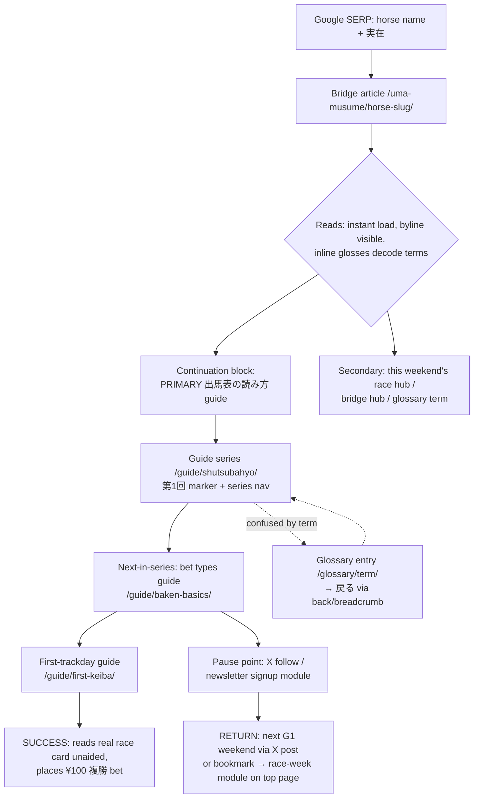
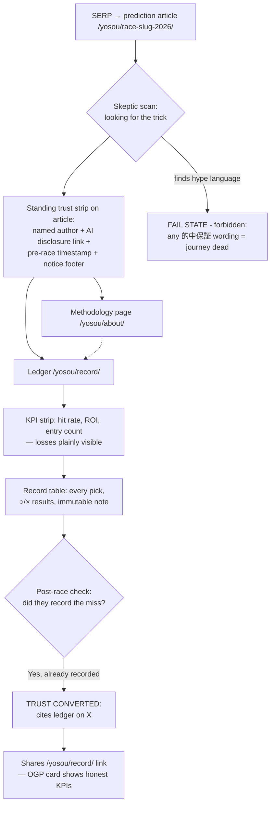
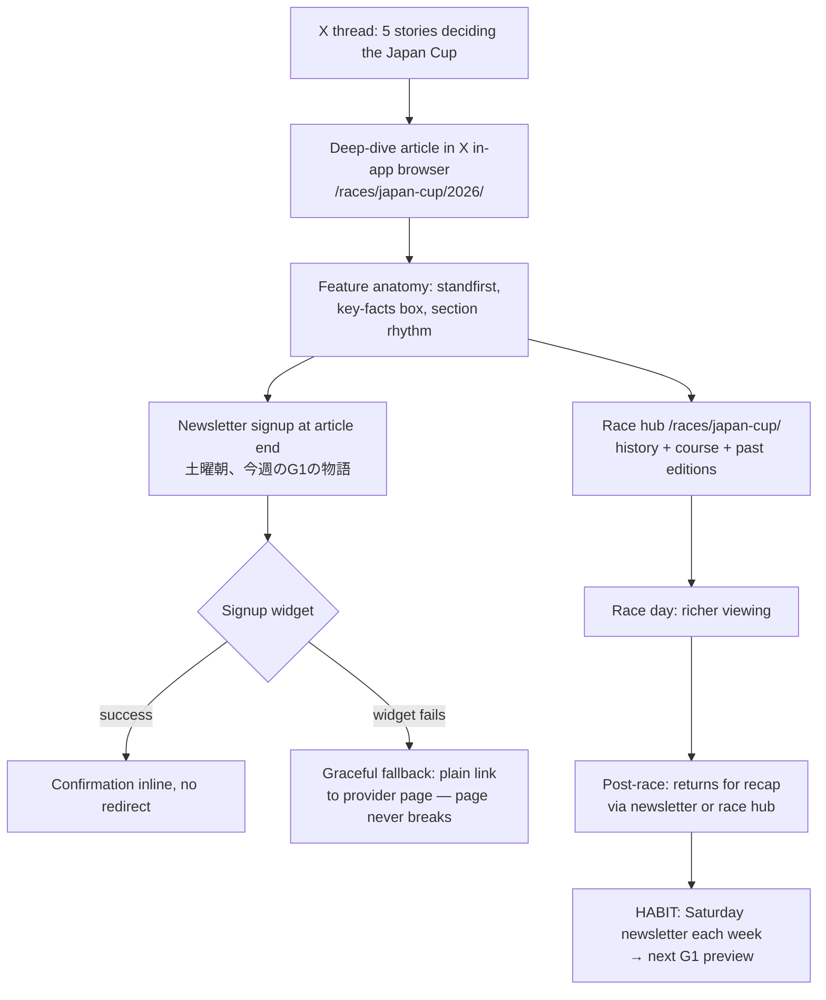
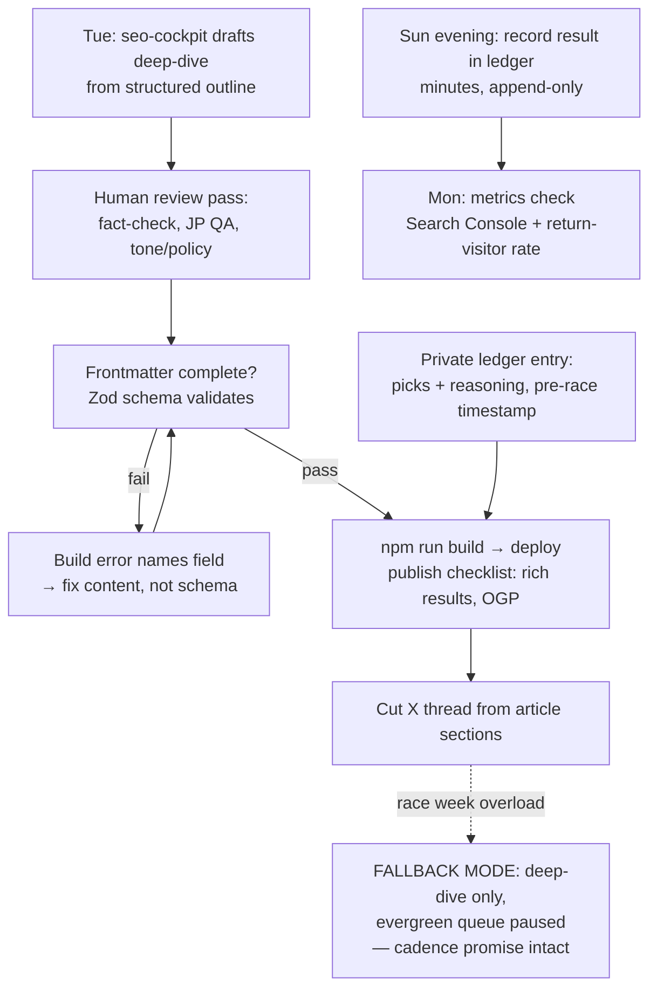

# UX Design Specification — Keiba Media Pivot (ウマノミカタ)

**Author:** Luonghailam
**Date:** 2026-08-26

---

<!-- UX design content will be appended sequentially through collaborative workflow steps -->

## Executive Summary

### Project Vision

ウマノミカタ (working name) converts the existing high-performance Astro 5 static codebase into a Japanese horse-racing (keiba) media brand that owns the beginner journey end-to-end: curiosity → first race card (出馬表) → first small bet → first G1 weekend. The positioning thesis is "the graduation path from Uma Musume to real racing." The UX must express three content pillars — a beginner education hub (初心者向け), a G1/重賞 analysis magazine, and (Phase 2, after a private dry run) a transparent AI prediction ledger — plus a signature Uma Musume → real-horse bridge vertical woven through the first two pillars.

The experience is defined as much by what it refuses to do as by what it does: no ads that shift the page, no registration walls, no "絶対的中" hype, no paywalled basics. Speed (mobile Lighthouse 99–100, protected budget), plain language, and visible honesty ARE the product. Every UX decision must survive two filters: (1) does it keep the zero-JS-by-default, system-font, static-only performance posture; (2) does it deepen the anti-scam trust positioning.

### Target Users

**Primary — the new-generation beginner (Yui, 25):** 20s–30s, mobile-first (iOS Safari / Android Chrome, 375px baseline), arrives from Uma Musume fandom or SNS (X, LINE in-app browsers). Reads on trains and on weekend mornings before races. Needs plain-language explanations with jargon decoded inline, zero commitment (no registration, no payment), and continuous reassurance that this is not a scam tip site. Success feeling: "I understood the race card, placed my first ¥100 bet, and enjoyed the G1 more because I knew the stories."

**Secondary — the casual-to-intermediate fan (Aoi, 34 / Kenta, 29):** follows G1s casually or bets small most weekends; finds netkeiba exhausting and paywalls not worth it. Wants magazine-grade context (history, course quirks, pedigree narratives) and — for the skeptic — verifiable honesty: a ledger that records its own losses. Arrives via X threads during race weeks; returns on the JRA calendar rhythm.

**Operator (Luonghailam):** solo operator on a 10 hours/week budget; the UX system must be operable through the pipeline → git → `npm run build` loop with Zod-enforced content schemas — no CMS, no bespoke per-article layout work.

### Key Design Challenges

1. **Trust made visible without saying "trust us."** The 予想サイト category is scam-defined; JRA itself publishes warnings. The design must communicate legitimacy structurally — named authorship on every article, disclosure links, responsible-gambling/under-20 notices on all betting-adjacent pages, honest ledger presentation including losses — without cluttering the reading experience or lecturing the reader.
2. **Beginner comprehension in a jargon-dense domain, at zero JS.** Inline glossary explanation of terms like 複勝, 脚質, 馬場 must work as a static-first pattern (no tooltip library, no hydration cost) on a 375px screen with space-less Japanese text.
3. **Performance budget as a hard constraint on every pattern.** Lighthouse 99–100 on every page type; system fonts only; `client:visible` islands only when justified. Any pattern that assumes JS (carousels, mega-menus, interactive filters) needs a static or CSS-only alternative.
4. **Three pillars + a bridge vertical in one coherent IA.** Beginner hub, magazine, glossary, (later) ledger, and Uma Musume bridge content must be navigable from any page (FR6) without a portal-style clutter that recreates the netkeiba problem.
5. **A Phase-2 ledger that must be designed now.** The public ledger (FR16–18) launches later, but the IA, trust architecture, and footer/notice patterns must accommodate it from day one so its debut is an unveiling, not a redesign.

### Design Opportunities

1. **Instant-load as a felt brand moment.** Against incumbents whose ads shift under the reader's thumb, a page that loads instantly and never moves is a visceral differentiator — the first trust signal, delivered before a word is read.
2. **The ledger as a signature UX artifact.** No competitor shows losses. An immutable, scannable, shareable hit/ROI record — designed to look like an accounting document, not a sales page — is a first-mover pattern that compounds and cannot be backfilled.
3. **The bridge-article format as a designed on-ramp.** A repeatable article pattern (real horse's story → "see her legacy this weekend" → race-card guide) turns emotional Uma Musume search intent into guided next steps — the whole product thesis expressed as one internal-linking pattern.
4. **Calendar-rhythm UI.** The JRA calendar gives the site a natural pulse (this week's G1, next race hub, Saturday newsletter). Surfacing "what's this weekend" consistently converts one-time readers into habitual returners — the retention hypothesis made tangible.
5. **Reading-first Japanese typography.** With system fonts locked in, generous line-height, disciplined line length, and clean vertical rhythm can make this the most comfortable long-form keiba reading experience on mobile — a quality bar incumbents structurally cannot match under ad density.

## Core User Experience

### Defining Experience

**The core loop is reading an article on a phone and knowing, without friction, what to read next.** The single most frequent action is: land on an article (from search or SNS) → read to the end without confusion → follow one designed next step (a glossary term explained inline, a linked guide, this weekend's race hub, or a follow/subscribe touchpoint). If this loop is effortless, every business metric (scroll depth ≥70%, 2+ articles per session, return visits on the race calendar) follows.

The one interaction that is absolutely critical to get right: **inline jargon comprehension.** A beginner reading 「複勝で100円」 must be able to understand the term at the exact point of confusion, without leaving the article, without JS overhead, and without breaking reading flow. This is the atomic unit of the "graduation path" promise.

### Platform Strategy

- **Mobile-first responsive web (MPA).** No app. Priority 1: Mobile Safari (iOS 16+) and Chrome on Android at the 375px baseline; Priority 2: desktop browsers at 1240px+. Touch is the primary input; all targets ≥44×44px.
- **In-app browsers are first-class.** X and LINE in-app browsers are major entry points (distribution strategy funnels through them); pages must render perfectly there and OGP previews (1200×675) must be correct on every shareable URL.
- **Static delivery is the platform.** Every page prerendered; zero client JS by default; interactivity via vanilla `<script>` for trivial toggles and React 19 islands (`client:visible`) only when justified. No offline features, no push, no device APIs — the "capability" this product leverages is raw speed.
- **Reading conditions:** commuter trains (one thumb, unstable connection — static HTML wins), weekend mornings at home, and race-day on-site (paddock, glare — high contrast, large touch targets).

### Effortless Interactions

- **Landing → orientation:** any entry page answers within one viewport: what site is this, why is it trustworthy (author byline, clean design), and where am I (breadcrumb, pillar label).
- **Jargon decoding:** first occurrence of a glossary term in an article is explained inline; the term also links to its glossary entry. Zero taps required to understand; one tap to go deeper. No registration, no tooltip library.
- **Next-step discovery:** every article ends with a designed continuation (related guides / this weekend's races / the pillar hub) — the reader never hits a dead end. Competitors require the user to fight navigation; here the path is laid.
- **"What's this weekend":** from any page, reaching the current race week's content takes one tap (persistent nav entry). The JRA calendar does the scheduling work for the reader.
- **Subscribing:** X follow / LINE / newsletter signup are single-action touchpoints placed at natural pause points (article end, race hub), never as interruptive overlays. A failed signup widget never breaks the page (NFR13).
- **What we deliberately eliminate:** registration walls, cookie banners (cookieless analytics), interstitials, infinite scroll, auto-playing media, layout shift of any kind. Absence of friction IS the interaction design.

### Critical Success Moments

1. **The first paint (0–1s):** the page appears instantly and never shifts. The reader's netkeiba-trained flinch ("where's the ad going to jump?") doesn't fire. This is the "this is better" moment and it happens before reading starts.
2. **The first decoded term (first 30 seconds):** a jargon word is explained in plain language exactly where it appears. The beginner feels spoken to, not gatekept.
3. **The 出馬表 "aha":** after the race-card guide, the reader can decode a real race card unaided (scroll depth ≥70% is its proxy). This is the product's promised transformation.
4. **The ledger honesty check (Phase 2):** a skeptic looks for the trick — and finds last month's losses recorded with honest ROI. The moment that converts distrust into advocacy. If the ledger ever feels salesy, the brand is dead; this flow can never fail.
5. **The return visit:** next race weekend, the reader comes back (bookmark, X, newsletter) and finds fresh race-week content exactly where expected. Rhythm confirmed = habit formed.

### Experience Principles

1. **Speed is the first sentence.** Every page must feel instant and immovable; no pattern that costs layout stability or JS budget ships. Performance is brand, not hygiene.
2. **Explain at the point of confusion.** Never send a beginner elsewhere to understand a sentence; jargon is decoded inline, depth is one tap away.
3. **Honesty is structural, not stated.** Trust signals (named author, disclosures, notices, losses in the ledger) are built into layouts as standing elements — the design never needs to claim trustworthiness.
4. **Always a next step, never a dead end.** Every page ends with a designed continuation aligned to the graduation path; internal linking is a first-class layout element, not an afterthought.
5. **The calendar is the interface rhythm.** Race-week content surfaces predictably (this weekend, one tap away); evergreen content stays stable. The site breathes on the JRA calendar.
6. **Quiet screens, loud content.** Chrome is minimal and consistent; the article is the hero. Anything decorative that competes with reading comprehension is cut.


## Desired Emotional Response

### Primary Emotional Goals

- **Relief and safety ("ここは大丈夫" — "this place is okay").** The dominant feeling for the beginner must be safety: no scam smell, no pressure to pay, no one is trying to take her money. In a category defined by fraud warnings, safety is the emotion users will tell friends about ("the one honest one").
- **Growing competence.** After each guide the reader should feel measurably more capable — "I can read a 出馬表 now." The site's promise is a transformation (fan → informed fan), so accomplishment beats delight.
- **Anticipation on the calendar rhythm.** Race weeks should feel like an event the site shares with the reader — quiet excitement building toward Sunday, richer because the stories are known (Aoi's journey).
- **Respected, not marketed to.** Readers should feel treated as intelligent adults learning something new — never as conversion targets in a funnel.

### Emotional Journey Mapping

| Stage | Desired feeling | Anti-feeling to prevent |
|---|---|---|
| First discovery (search/SNS tap) | Instant calm: page loads fast, looks clean, nothing shifts | The netkeiba flinch: bracing for ads/popups |
| First article read | Understood: plain words, terms decoded inline | Gatekept: jargon walls, insider shorthand |
| Deciding whether to trust | Reassured by evidence: named author, policy links, no hype language | Suspicion: anonymous authorship, "絶対的中" vibes |
| Completing the core task (decoding 出馬表, first bet) | Quiet pride and agency: "I chose this bet and I know why" | Overwhelm, or pushed into betting more than intended |
| Something goes wrong (404, failed signup widget) | Unbothered: page still works, clear path back | Broken-site alarm, which reads as "scam" in this category |
| Returning next race week | Familiar rhythm: fresh weekend content exactly where expected | Staleness ("nothing new"), or a rearranged interface |
| Checking the ledger after a loss (Phase 2) | Deepened trust: the loss is recorded, honestly | Betrayal: hidden losses = instant, permanent brand death |

### Micro-Emotions

- **Trust vs. skepticism — the critical axis.** Every screen is evaluated by a scam-primed reader. Standing trust furniture (byline, disclosure links, footer notices) must appear consistently; a single hype-flavored element resets skepticism.
- **Confidence vs. confusion.** Confusion is the churn moment for beginners; inline explanation and predictable layout keep the reader confident enough to continue.
- **Calm vs. urgency.** This site never manufactures urgency (no countdowns, no 「今すぐ」 pressure). Race-day anticipation is the only permitted excitement, and it comes from content, not UI.
- **Belonging vs. embarrassment.** Beginners fear looking naive. Tone and design must normalize not-knowing ("everyone starts here") — the beginner pillar is front and center, never a buried footnote.
- **Responsibility without moralizing.** Under-20/responsible-gambling notices should read as care and professionalism, not legal boilerplate or finger-wagging.

### Design Implications

- Safety → clean white space, restrained palette, zero dark patterns, no exclamation-heavy CTAs; disclosure links visible at consistent locations; footer notices styled as calm standing information.
- Competence → guides structured as progressive steps with clear headings, summary boxes, and "what you can do now" closings; glossary terms marked with a subtle, consistent visual (not attention-stealing).
- Anticipation → a persistent but quiet "this weekend" surface (top page module + nav entry) whose content changes on the calendar while its position never does.
- Respect → no interstitials, no scroll-jacking, no fake scarcity; subscribe touchpoints appear at natural pauses with honest copy about what the reader gets.
- Trust-under-audit (ledger) → tabular, record-like presentation; losses styled with the same visual weight as wins; timestamps visible; nothing animated or promotional.
- Error resilience → styled 404 with pillar links; signup widgets degrade to a plain link; nothing modal.

### Emotional Design Principles

1. **Never trigger the scam reflex.** Any element that could appear on a 予想サイト sales page (hype, urgency, blurred paywalls, anonymous claims) is banned outright.
2. **Make competence visible to the reader.** Design guides so readers can feel their own progress; the product's success moment belongs to the user, not the brand.
3. **Excitement comes from racing, not from UI.** The interface stays calm; the stories carry the thrill.
4. **Consistency is an emotion.** Same trust furniture, same rhythm, same places — familiarity is how a weekly-return habit feels safe.
5. **Honesty even when it hurts.** Losses, corrections, and AI disclosure are presented with the same design dignity as wins — that asymmetry-free presentation IS the brand's emotional core.

## UX Pattern Analysis & Inspiration

### Inspiring Products Analysis

Chosen for what the target user (JP, 20s–30s, mobile, SNS-native) actually reads daily, plus category references from the competitive research:

- **note.com (JP writing platform):** the reading experience today's 20s–30s Japanese users consider "clean." One-column article layout, generous whitespace, calm typography, author identity (avatar + name) at top and bottom of every piece, follow action at natural pause points. Proves that a minimal, author-forward reading page feels premium and trustworthy to this exact demographic. Returns are driven by creators, not gamification.
- **Smart News / Yahoo!ニュース topics (JP news habits):** mobile news consumption pattern — headline lists that scan in seconds, category tabs, no-nonsense density. Lesson: JP users tolerate compact lists well; scannability beats card-art flourish for repeat visitors. Also a cautionary reference: their ad load shows exactly what we refuse to become.
- **Wikipedia (mobile):** where Yui actually lands today when she searches a real horse's name. Strengths: instant load, inline links for every unfamiliar term, absolute neutrality reads as trustworthiness. Weaknesses we fix: no narrative warmth, no guided next step, no editorial voice. Our bridge articles are "Wikipedia's trust + magazine's storytelling + a designed next step."
- **netkeiba (anti-model with real lessons):** the incumbent's information architecture (race-centric hubs, columns, news) proves what fans need to exist; its execution (shifting ads, paywalled basics, insider shorthand) is the precise experience we invert. We keep its concept of "one page per race" — as clean evergreen hub pages.
- **Racing Post / The Athletic (magazine references):** long-form sports analysis with strong art direction, clear bylines, series/collection structure. Lesson for the G1 magazine pillar: a deep-dive reads as a feature story (standfirst, section rhythm, pull context boxes), not a blog post. We take the editorial form, not the paywall.
- **JRA official site:** authority signals (calendar-driven structure, sober tone) without editorial warmth. Their race calendar's primacy confirms the calendar-rhythm IA; their utilitarian dryness is the gap our magazine voice fills.

### Transferable UX Patterns

**Navigation patterns:**
- Pillar-tab IA (note/SmartNews): a small, fixed set of top-level destinations (初心者, レース, ウマ娘×競馬, 用語集, 予想 later) — legible in one glance on 375px, matching FR6 navigate-by-pillar.
- Race-centric hub page (netkeiba, inverted): one canonical URL per G1 that accumulates yearly content — our evergreen hub model (FR5) with magazine curation instead of data dumps.
- Breadcrumbs everywhere (SEO + orientation): already in codebase (Breadcrumb.astro + BreadcrumbList JSON-LD); every content page states its place in the pillar tree.

**Interaction patterns:**
- Inline term linking (Wikipedia): first-occurrence explanation in the running text plus a marked link to the glossary entry — static, zero JS, exactly our critical interaction.
- Author block top + bottom (note): byline with avatar near the title; fuller author card with profile link at article end — E-E-A-T and trust in one pattern.
- End-of-article continuation module (note/The Athletic): related articles + pillar hub link + follow/subscribe touchpoint as one designed unit at the natural pause point.
- Series/collection framing (The Athletic): guides presented as an ordered learning path (第1回, 第2回…) so beginners always know "where am I in the curriculum."

**Visual patterns:**
- One-column, reading-width article body (note): no sidebars on mobile article pages; content is the interface.
- Sober record table (bank statements / JRA results in spirit): the ledger presented as an accounting document — dense, columnar, timestamped, unstyled by marketing.
- Quiet section rhythm (The Athletic): alternating background tints and clear H2 breaks give long articles scannable structure without decorative noise.

### Anti-Patterns to Avoid

- **Layout-shifting ad slots and floating overlays (netkeiba):** the single most-cited user pain; we ship zero ads and zero CLS — this is a contract, not a preference.
- **Paywalled basics / registration nags:** any gate before value destroys the beginner promise (FR1: read without registration or payment).
- **予想サイト sales-page grammar:** countdown timers, "本日限定," blurred "premium picks," LINE-DM funnels, fabricated win screenshots — banned outright; even visual echoes of these (heavy red/yellow bursts, stamp-style badges) must be avoided.
- **Portal-density home page (netkeiba/Yahoo):** dozens of modules competing for attention; our top page holds a strict hierarchy (this weekend → start here → latest) instead.
- **Insider-shorthand labeling:** nav or headings using unexplained jargon (単勝/馬連/斤量 without support) recreates the gatekeeping we exist to remove.
- **Anonymous content:** unsigned articles are a scam-category signal; every article carries the named author.
- **Interaction-cost decorations:** carousels for content discovery, hover-dependent menus, JS tooltips — all conflict with the performance budget and touch-first use.

### Design Inspiration Strategy

**Adopt:**
- note.com's author-forward one-column reading page — directly supports trust + reading-first principles.
- Wikipedia's inline-link comprehension model — implements the critical jargon interaction with zero JS.
- Calendar-primary organization from JRA — the race calendar as the site's visible heartbeat.

**Adapt:**
- netkeiba's race-hub concept → curated evergreen G1 hub pages (stories and guides, never data tables) refreshed annually.
- The Athletic's feature-article anatomy → G1 deep-dive template (standfirst, key-facts box, section rhythm) simplified for solo-operator production via one repeatable layout.
- SmartNews-style compact lists → pillar hub and listing pages: scannable rows with title/category/date, minimal imagery, fast to render and fast to scan.
- note's follow touchpoint → X follow / LINE / newsletter module placed at article end and race hubs (never modal, never interruptive).

**Avoid:**
- Everything in the anti-pattern list above; additionally, any pattern requiring a JS island for core reading/navigation (islands are reserved for future Phase-2 tools like the payout simulator).

## Design System Foundation

### Design System Choice

**Decision: a custom lightweight design system built on the existing Tailwind CSS v4 token foundation — evolve the brownfield system, do not adopt an external component library.**

Concretely: design tokens live exclusively in the `@theme` block of `src/styles/global.css` (rebranded for keiba); components are hand-built `.astro` components (flat `src/components/`), styled with Tailwind utilities plus the established CSS-variable conventions (`THEME` from `@config/theme` for TS/JSX contexts, `--u` fluid-unit trick for pixel-precise mobile sections); typography and JP text helpers extend the existing `global.css` custom classes. No MUI/Chakra/shadcn, no Tailwind UI purchase, no component framework.

### Rationale for Selection

1. **The performance budget rules out component libraries.** Every established React-based system (MUI, Chakra, Ant) assumes hydrated components — incompatible with zero-JS-by-default and the Lighthouse 99–100 protected baseline. Even headless libraries add JS for patterns we implement in pure HTML/CSS.
2. **The system already exists and is proven.** The codebase carries a working token pipeline (Tailwind v4 `@theme` → utilities → components), ~29 production-tested `.astro` components, Japanese typography helpers, accessibility conventions (focus rings, touch targets, `scroll-margin-top` registry), and a build gate. The pivot needs a re-skin and new content components, not a new foundation.
3. **A content site needs few component types.** The whole product is ~8 page templates and ~15 recurring components (article body, cards, hubs, nav, notices, tables). A full design system would be over-engineering for a solo operator.
4. **Uniqueness matters here.** Trust positioning depends on NOT looking like a template or a typical affiliate blog; a bespoke, restrained visual identity on custom tokens delivers that at no JS cost.
5. **Solo-operator maintenance.** One person maintains this; a flat set of small `.astro` files with tokens in one place is the lowest-cognitive-load system possible. No library version churn.

### Implementation Approach

- **Token layer:** replace home-services brand values in `@theme` (`src/styles/global.css`) with the keiba palette/typography scale defined in Visual Design Foundation (below). Utilities regenerate automatically (`bg-*`, `text-*`); `src/config/theme.ts` mirrors tokens as `var(--color-*)` strings for the rare TS/JSX use.
- **Component layer:** audit the existing 29 components — retain and re-skin the structural ones (Header, Footer, MobileMenu, Breadcrumb, Pagination, RelatedPosts, FAQAccordion, CTABlock as pattern bases); retire home-services-specific ones (PriceBar, PricingTier, AreaMap, ContactFormSection, ProcessFlow, ServiceKV, ComparisonTable, ServiceSlider island, etc.); add new keiba content components (specified in Component Strategy, below).
- **Layout layer:** `BaseLayout.astro` remains the single page shell (head/meta/JSON-LD/Header/Footer); new page templates compose it.
- **Interaction layer:** vanilla `<script>` in `.astro` for the mobile menu and accordions (existing pattern); no React island ships in MVP (`ServiceSlider.tsx` is retired; the carousel libraries Embla + Swiper are removed during conversion — no carousel exists in the new design).
- **Enforcement:** `npm run build` (TS strict + Zod) remains the gate; component conventions (Props interface, variant string unions, no hardcoded hex/brand values) carry over unchanged from project-context.md.

### Customization Strategy

- **Brand expression happens at exactly three levels:** tokens (color/type/spacing in `@theme`), a small set of signature components (glossary term marker, trust byline block, ledger table, race-week module), and editorial imagery conventions (hero/OGP image templates). Everything else stays deliberately plain.
- **Dark mode: not in scope.** Single light theme; explicit token backgrounds. (A dark theme would double the visual QA surface for a solo operator with no user demand evidence — revisit post-MVP if reader feedback asks for night reading.)
- **Extension discipline:** new visual needs are met by adding a token or a component variant — never one-off hex values, never `@apply`, never a second styling mechanism. JP typography edge cases extend the existing `global.css` helper classes.
- **Phase-2 readiness:** interactive tools (payout simulator, annotated 出馬表 reader) will be React 19 islands using the same tokens via `THEME`; the ledger's public debut reuses the ledger-table component already designed in MVP for the private dry run.

## Detailed Core Experience — The Defining Interaction

### Defining Experience

**"Guided reading": every article decodes itself and hands you the next step.** If a friend asks Yui why she uses this site, the answer is: "it explains everything in normal words, and it always tells you what to read next." The defining interaction is the **decode-and-continue loop** inside an article page:

1. jargon term appears → it is explained right there (inline gloss);
2. article ends → a designed continuation block offers the exact next step on the graduation path (next guide in the series, this weekend's race hub, the glossary entry, follow/subscribe).

This single interaction implements the product thesis (beginner journey ownership), the retention hypothesis (2+ articles/session, calendar returns), and the SEO strategy (dense, semantic internal linking) simultaneously. Nail it, and homepage, hubs, and nav are just entry ramps into the loop.

### User Mental Model

- **Current model:** "I google something, land somewhere, and either it's Wikipedia (trustworthy but dry, no next step) or a keiba site (assumes I already know everything, plus ads everywhere, plus maybe a scam)." Reading about keiba currently means tab-juggling: article in one tab, term searches in three others.
- **Expectation brought to our site:** blog/article conventions — title, hero image, byline, scroll to read. We meet this exactly; zero novel navigation to learn.
- **The mismatch we must bridge:** beginners don't know what they don't know. They can't formulate "what is 複勝" as a navigation goal mid-sentence; the site must anticipate the confusion point and resolve it in place. That is why the glossary is delivered *into* the text rather than waiting to be visited.
- **Confusion risks:** (1) if inline glosses look like ads/affiliate links, the scam reflex fires — the marker style must read as "dictionary," not "promotion"; (2) if a continuation block offers too many choices, decision paralysis kills the second-article metric — one primary next step, few secondary ones.

### Success Criteria

- A first-time reader finishes a guide without opening a second tab to search a term (tab-juggling eliminated).
- Guide scroll-depth ≥70% and glossary/internal-link follow-through measurable (PRD user-success metrics).
- ≥2 articles per session for new visitors landing on bridge or guide articles; the continuation block is the click source.
- The reader can state where they are in the learning path ("this is part 2 of the betting basics series") without visiting the hub.
- Zero JS cost: the whole loop (gloss, links, continuation) ships as static HTML; page remains Lighthouse 99–100.
- On a 375px screen, an inline gloss never breaks Japanese line-wrapping or causes horizontal overflow.

### Novel UX Patterns

**Verdict: established patterns, uniquely combined — no user education needed.** The components are all familiar: dictionary-style inline explanation (Wikipedia), series navigation (serialized web novels/note magazines), related-content blocks (every media site). The twist — our defensible pattern — is that continuation is *curated by journey stage*, not by algorithmic similarity:

- a **bridge article** continues to → the featured horse's races + the race-card guide (fan → learner);
- a **beginner guide** continues to → the next guide in its series + a "try it this weekend" race link (learner → practitioner);
- a **G1 deep-dive** continues to → that race's hub + the relevant explainer for its jargon (viewer → habitual reader).

This journey-stage routing is editorial logic encoded in frontmatter (schema fields for series order, related races/horses/terms), not a recommender system — solo-operator maintainable and fully static.

### Experience Mechanics

**1. Initiation** — the reader simply reads; the loop needs no trigger. Glossary terms are marked with a quiet, consistent visual treatment (dotted underline + the term set slightly emphasized — specified in UX Patterns) that says "help available" without demanding attention.

**2. Interaction** —
- *Inline gloss (zero-tap):* first occurrence of a term in an article carries a short plain-language explanation in the running text — written into the sentence (「複勝（3着以内に入れば当たりの買い方）」 style) per the content template; comprehension costs nothing.
- *Glossary link (one-tap):* the marked term links to its glossary entry page (`/glossary/fukusho/` style) for depth: definition, example, related terms, "used in these guides."
- *Continuation (one-tap):* at article end, the continuation block presents ONE primary next step (large, labeled with why: 「次はこれ：出馬表の読み方」) and 2–3 secondary paths (race hub, pillar hub, glossary). Below it, the author card and follow/subscribe touchpoints.

**3. Feedback** — static-site feedback is structural, not animated: the linked page loads instantly (speed IS the feedback); breadcrumb + series position marker (「初心者ガイド 第2回／全6回」) confirm progress; visited-link styling shows covered ground. Mistake recovery: back button always works (MPA), breadcrumb one tap from anywhere.

**4. Completion** — the loop has two designed exits, both successes: (a) *competence exit* — the reader finishes a series and the final continuation block points outward: "this weekend's races" (apply the knowledge); (b) *rhythm exit* — the reader follows X / subscribes at a pause point, converting the session into a calendar habit. No engagement-maximizing tricks (no infinite feed): when the journey stage is served, we deliberately hand the reader to the racing weekend itself.

## Visual Design Foundation

No existing brand guidelines exist (brand name pending pre-MVP validation), so the visual foundation is defined here from the emotional goals (safety, competence, calm anticipation) and the anti-scam positioning. All values below become the new `@theme` block in `src/styles/global.css` and are the single source of truth. Deliberate differentiation note: netkeiba and JRA both brand in green — this site brands in deep ink-navy to be instantly distinguishable in a tab bar or SERP favicon row.

### Color System

**Brand palette (light theme only — dark mode out of scope, per Design System Foundation):**

| Token | Value | Usage |
|---|---|---|
| `--color-ink` | `#1A2333` | Primary text; near-black with a blue undertone (softer than pure black for long reading) |
| `--color-ink-soft` | `#55627A` | Secondary text: dates, captions, metadata |
| `--color-brand` | `#16324F` | Brand ink-navy: headings, header/footer surface, nav, primary buttons |
| `--color-brand-tint` | `#EEF3F8` | Tinted section backgrounds, quiet module fills (key-facts boxes, race-week module) |
| `--color-turf` | `#2F7D5A` | Secondary brand: beginner-pillar tag, progress/series markers, success states |
| `--color-turf-tint` | `#EAF4EF` | Beginner-pillar tinted fills (guide summary boxes) |
| `--color-accent` | `#C25E1E` | Single warm accent: primary CTA (subscribe/follow), "this weekend" highlights — used sparingly, never for hype |
| `--color-bridge` | `#8A4A63` | Uma Musume bridge pillar tag: warm plum — evokes the fandom's warmth without imitating game branding |
| `--color-paper` | `#FFFFFF` | Page background |
| `--color-paper-warm` | `#F7F6F3` | Alternating section background (warm off-white, magazine feel) |
| `--color-line` | `#E3E6EC` | Borders, dividers, table rules |
| `--color-win` | `#1E7A46` | Ledger hit marker (paired with ○/的中 text — never color-only) |
| `--color-loss` | `#B3261E` | Ledger miss marker (paired with ×/不的中 text — never color-only) |
| `--color-notice` | `#5A5F6A` | Responsible-gambling/under-20 notice text: calm gray, dignified, not alarm-styled |

**Semantic mapping:**

| Semantic | Token | Notes |
|---|---|---|
| Primary action (follow, subscribe) | `--color-accent` | Max one accent-colored element per viewport; calm imperative copy |
| Trust/authority surface | `--color-brand` | Header, footer, author block accents |
| Pillar identity | `--color-turf` / `--color-brand` / `--color-bridge` | Small tag chips only — pillars never recolor whole pages |
| Ledger outcomes | `--color-win` / `--color-loss` | Equal visual weight for wins and losses — the honesty rule as a token rule |
| Links in body text | `--color-brand`, underlined | Conventional, unambiguous; glossary terms use the distinct dotted-underline treatment |

**Contrast verification (WCAG 2.1 AA):** ink on paper 14.9:1; brand navy on paper 10.9:1; ink-soft on paper 6.0:1; accent `#C25E1E` on white 4.6:1 (passes AA for the bold ≥16px text it is restricted to); white on brand navy 10.9:1; white on accent 4.6:1; win/loss colors on white ≥4.5:1. All token pairs used for text must maintain ≥4.5:1; any new pairing is checked before merging.

### Typography System

**Font family — JP system stack only (protected decision; no webfonts ever):**

```
--font-sans: "Hiragino Kaku Gothic ProN", "Hiragino Sans", "BIZ UDGothic",
             "Yu Gothic Medium", "Yu Gothic", "Meiryo", system-ui, sans-serif;
```

Zero download, zero CLS, native rendering quality on the iOS-heavy target audience. Numerals in the ledger and race data use `font-variant-numeric: tabular-nums` for column alignment.

**Type scale (mobile-first; desktop values at ≥768px):**

| Element | Mobile | Desktop | Weight | Line height | Notes |
|---|---|---|---|---|---|
| H1 — article/page title | 24px | 32px | 700 | 1.35 | ≤2 lines target on 375px |
| H2 — section heading | 20px | 24px | 700 | 1.4 | Anchor-linkable in long guides |
| H3 — sub-heading / card title | 17px | 19px | 700 | 1.45 | |
| Body (article) | 16px | 17px | 400 | 1.9 | Generous JP long-form leading — the core reading surface |
| Body (UI/lists) | 14px | 15px | 400 | 1.6 | Listing rows, hub modules |
| Small/meta | 12px | 13px | 400 | 1.5 | Dates, categories, notices |
| Inline gloss | 15px | 16px | 400 | inherit | Same tone as body; parenthetical style |
| Display numbers (ledger ROI, hit rate) | 22px | 28px | 700 | 1.2 | tabular-nums |

**Japanese typography rules (inherited + extended):**
- `overflow-wrap: anywhere` helpers for space-less JP text (existing `global.css` utilities); no horizontal scroll ever.
- `letter-spacing: 0.03em` on headings; body text left at default.
- Article body max measure ~36–38 full-width characters per line on desktop (see layout); mobile fills the 343px content width.
- Bold (`font-weight: 700`) is the only in-text emphasis; no italic for JP text (renders poorly), no color-only emphasis.
- Form inputs (newsletter signup) keep `font-size: 16px` minimum (iOS zoom prevention, inherited rule).

### Spacing & Layout Foundation

- **Base unit:** 4px scale (Tailwind default spacing); the existing `--u: min(2.6667vw, 11px)` fluid-unit trick remains available for pixel-precise mobile hero/module work.
- **Containers:** article body max-width **680px** (optimal JP reading measure); listing/hub content max-width **1080px**; full-bleed only for header, footer, and section background tints.
- **Mobile padding:** 16px side padding (343px content at 375px); desktop 24–40px.
- **Vertical rhythm:** major page sections 48px (mobile) / 72px (desktop) apart; heading-to-content 16–24px; paragraph spacing 1em; continuation block separated by a 32px + divider gap so "article has ended" is unmistakable.
- **Grid:** single column on mobile (always); hub/listing pages use 2-column card/row grids at ≥768px and article pages stay single-column at all sizes (no sidebars — content is the interface). Desktop article pages center the 680px column; a sticky in-page ToC may occupy the left margin at ≥1240px only for long guides.
- **Header:** compact sticky header, ~56px mobile / 64px desktop; `scroll-margin-top` registry updated for all anchor targets (inherited rule).
- **Card/row spacing:** listing rows 12px vertical padding with hairline dividers (SmartNews-style scan density); feature cards 16px internal padding, 16–20px grid gap.

### Accessibility Considerations

- **Contrast:** all text pairs ≥4.5:1 (verified above); UI glyphs/borders ≥3:1 against adjacent colors.
- **Color independence:** ledger outcomes, pillar tags, and series progress always pair color with text or symbol (○/×, pillar name in the chip, 「第2回」) — no meaning by color alone.
- **Focus states:** `outline: 2px solid var(--color-brand); outline-offset: 2px` on all interactive elements; never removed without replacement.
- **Touch targets:** ≥44×44px for all tappable elements — nav items, glossary term links get padded tap areas via pseudo-element extension where the visual size is smaller.
- **Semantics:** landmarks (`header/nav/main/footer`), one `h1` per page, sequential heading levels (validated in the publish checklist), `aria-labelledby` on major sections, Japanese alt text on all content images (decorative SVGs: empty alt + `aria-hidden`).
- **Motion:** the design uses no autonomous motion (no carousels, no auto-anything); smooth-scroll for anchors disabled under `prefers-reduced-motion`.

## Design Direction Decision

### Design Directions Explored

Six homepage-led directions were mocked in `_bmad-output/planning-artifacts/ux-design-directions.html` (375px frames, real Japanese content, locked tokens):

1. **D1 紙面 — Racing Paper:** newspaper metaphor (double rules, multi-column digest) borrowing 競馬新聞 authority.
2. **D2 Quiet Magazine:** note.com-grade calm — white space, author-forward warm-paper hero, pillar chips, scannable list rows.
3. **D3 Turf Field:** green-led sporty energy with saturated turf surfaces.
4. **D4 Record Book:** ledger-led sobriety — KPI strip, tabular records, bank-statement dignity.
5. **D5 Calendar Pulse:** framed "this weekend" race module with date bar + single CTA, followed by a beginner on-ramp box.
6. **D6 Fan-Warm Bridge:** plum-toned, Uma Musume-fan-first front door with horizontal horse-story cards.

### Chosen Direction

**D2 "Quiet Magazine" as the base, absorbing two elements: D5's race-week module + beginner on-ramp box (homepage, above the fold, after the hero), and D4's record-book treatment as the canonical ledger-page pattern.** Rejected: D1 (insider gatekeeping signal, fragile JP multi-column at 375px), D3 (green-led branding collides with netkeiba/JRA; portal energy dilutes trust voice), D6 as a global direction (narrows audience to one IP cycle; drifts toward IP-adjacent styling — its horizontal story-card row survives only inside bridge hub pages).

### Design Rationale

- **Calm = trust:** the quiet magazine register is the visual opposite of a 予想サイト; it delivers the "ここは大丈夫" first impression the emotional goals demand.
- **Author-forward = E-E-A-T:** byline with avatar in the hero puts named authorship above the fold — trust structurally visible, and a Google quality signal.
- **Pillar chips = FR6:** one-glance navigation by pillar on 375px without a mega-menu or JS.
- **Calendar module = retention hypothesis:** D5's framed weekend card gives the JRA rhythm a fixed, recognizable home; content changes weekly, position never does.
- **Record-book ledger = the honesty artifact:** D4's equal-weight win/loss table with a standing integrity note is precisely the "accounting document, not sales page" the Kenta journey requires.
- **Beginner on-ramp box = the promise stated:** 「競馬、はじめてですか？」on the homepage normalizes not-knowing and routes to the guide series in one tap.

### Implementation Approach

- Homepage composition order (mobile): compact header → pillar chips → race-week module (D5) → beginner on-ramp box (D5) → featured deep-dive hero (D2) → latest-articles list rows → footer with standing notices.
- The D2 hero surface uses `--color-paper-warm`; the race-week module is bordered `--color-brand` with the single `--color-accent` CTA; the on-ramp box uses `--color-turf-tint`.
- Article, hub, and listing templates inherit D2's one-column reading register; the ledger template inherits D4; bridge hub pages may add the D6 story-card row (CSS scroll, no JS island).
- All directions were designed within the zero-JS constraint; nothing chosen requires hydration.

## User Journey Flows

The four PRD journeys are designed here as concrete screen-level flows. Route names are indicative (final slugs come from keyword research); page templates referenced are specified in Component Strategy.

### Journey 1 — Yui: Uma Musume fan to first bet (primary happy path)

Entry: Google search 「(馬名) 実在」 on a Saturday-morning train → bridge article.


```mermaid
flowchart TD
    A[Google SERP: horse name + 実在] --> B[Bridge article /uma-musume/horse-slug/]
    B --> B1{Reads: instant load, byline visible,\ninline glosses decode terms}
    B1 --> C[Continuation block:\nPRIMARY 出馬表の読み方 guide]
    B1 --> C2[Secondary: this weekend's race hub /\nbridge hub / glossary term]
    C --> D[Guide series /guide/shutsubahyo/\n第1回 marker + series nav]
    D --> E[Next-in-series: bet types guide\n/guide/baken-basics/]
    E --> F[First-trackday guide\n/guide/first-keiba/]
    F --> G[SUCCESS: reads real race card unaided,\nplaces ¥100 複勝 bet]
    D -.confused by term.-> H[Glossary entry /glossary/term/\n→ 戻る via back/breadcrumb]
    H -.-> D
    E --> I[Pause point: X follow /\nnewsletter signup module]
    I --> J[RETURN: next G1 weekend via X post\nor bookmark → race-week module on top page]
```

- **Steps to value:** comprehension is step 0 (inline gloss); the full fan→bettor arc is 3 linked guides, each ending with exactly one primary next step.
- **Confusion recovery:** every glossary side-trip returns via back button (MPA) or breadcrumb; series marker (第n回／全6回) restores orientation.
- **Journey-blocking failure prevented:** no registration, no paywall, no interstitial anywhere on the path (FR1).

### Journey 2 — Kenta: the skeptic who audits the ledger (Phase 2 public; designed now)

Entry: search lands on a prediction article; guard fully up.


```mermaid
flowchart TD
    A[SERP → prediction article /yosou/race-slug-2026/] --> B{Skeptic scan:\nlooking for the trick}
    B --> C[Standing trust strip on article:\nnamed author + AI disclosure link +\npre-race timestamp + notice footer]
    C --> D[Methodology page /yosou/about/]
    C --> E[Ledger /yosou/record/]
    E --> E1[KPI strip: hit rate, ROI, entry count\n— losses plainly visible]
    E1 --> E2[Record table: every pick,\n○/× results, immutable note]
    E2 --> F{Post-race check:\ndid they record the miss?}
    F -->|Yes, already recorded| G[TRUST CONVERTED:\ncites ledger on X]
    G --> H[Shares /yosou/record/ link\n— OGP card shows honest KPIs]
    D -.-> E
    B -->|finds hype language| X[FAIL STATE - forbidden:\nany 的中保証 wording = journey dead]
```

- **Design guarantee:** the ledger page is reachable in one tap from every prediction article; result recording happens race-day evening (Journey 4) so the skeptic's Sunday check always finds the miss already posted.
- **Shareability:** the ledger URL is the trust flywheel's payload — its OGP image carries the honest KPI numbers, updated per build.
- **Fail state is a compliance rule, not a UX state:** 景品表示法-safe wording (FR12) means node X can never exist.

### Journey 3 — Aoi: the G1-week habit (secondary)

Entry: X thread on Tuesday of Japan Cup week.


```mermaid
flowchart TD
    A[X thread: 5 stories deciding the Japan Cup] --> B[Deep-dive article in X in-app browser\n/races/japan-cup/2026/]
    B --> B1[Feature anatomy: standfirst,\nkey-facts box, section rhythm]
    B1 --> C[Race hub /races/japan-cup/\nhistory + course + past editions]
    B1 --> D[Newsletter signup at article end\n土曜朝、今週のG1の物語]
    D --> D1{Signup widget}
    D1 -->|success| E[Confirmation inline, no redirect]
    D1 -->|widget fails| E2[Graceful fallback: plain link\nto provider page — page never breaks]
    C --> F[Race day: richer viewing]
    F --> G[Post-race: returns for recap\nvia newsletter or race hub]
    G --> H[HABIT: Saturday newsletter each week\n→ next G1 preview]
```

- **In-app browser first:** this journey mostly runs inside X/LINE webviews — static pages render perfectly there; OGP (1200×675) is part of the flow, not decoration.
- **Hub accumulation:** the race hub URL is permanent (FR5); each year's deep-dive/recap attaches to it, so Aoi's habit deepens on one bookmark.

### Journey 4 — Operator: a race week in the loop (admin/ops)

The operator's "UI" is the pipeline + git + build gate; UX design contributes guardrails, not screens.


```mermaid
flowchart TD
    A[Tue: seo-cockpit drafts deep-dive\nfrom structured outline] --> B[Human review pass:\nfact-check, JP QA, tone/policy]
    B --> C[Frontmatter complete?\nZod schema validates]
    C -->|fail| C1[Build error names field\n→ fix content, not schema]
    C1 --> C
    C -->|pass| D[npm run build → deploy\npublish checklist: rich results, OGP]
    D --> E[Cut X thread from article sections]
    B2[Private ledger entry:\npicks + reasoning, pre-race timestamp] --> D
    F[Sun evening: record result in ledger\nminutes, append-only] --> G[Mon: metrics check\nSearch Console + return-visitor rate]
    E -.race week overload.-> H[FALLBACK MODE: deep-dive only,\nevergreen queue paused\n— cadence promise intact]
```

- **UX guardrails for ops:** article templates make every layout decision once (no per-article design work); Zod schemas ARE the editorial checklist's enforcement layer (FR28); ledger entry is a content file with a schema-required timestamp field — immutability is a convention enforced by append-only workflow + git history (NFR10).

### Journey Patterns

- **Entry is always an article, never the homepage.** SEO/SNS land readers deep; therefore every article template carries full orientation (breadcrumb, pillar tag, byline) and the complete trust strip — no page assumes prior context.
- **The continuation block is the universal router.** All three reader journeys advance through the same end-of-article component, with journey-stage-specific primary links (bridge→guide, guide→next-in-series, deep-dive→hub).
- **Hubs are destinations, not indexes.** Pillar hubs and race hubs curate (intro, learning path order, featured stories) rather than list chronologically.
- **Trust furniture repeats identically everywhere:** byline block, disclosure links, footer notices — same position, same styling, every page type.
- **Subscribe at pause points only:** article end, hub end — never mid-content, never modal.

### Flow Optimization Principles

1. **Zero-step comprehension before one-step navigation:** decode in place first; link second.
2. **One primary next step per screen:** continuation blocks rank options; the primary action is visually singular.
3. **Progress is stated, not gamified:** series markers (第2回／全6回), hub timelines — informational, no badges/streaks.
4. **Every failure degrades to reading:** failed widgets become links; 404 offers pillar entries; nothing modal, nothing blocking.
5. **Speed is a journey feature:** every hop in every flow is a full page load — the architecture makes that faster than an SPA transition, and journeys are designed to exploit it (many small hops are fine).

## Component Strategy

### Information Architecture & Page Template Inventory

Component needs derive from the IA. Site map (routes indicative; slugs finalized with keyword research):

```
/                               Top page (homepage)
/guide/                         Beginner hub 初心者向け (curated learning paths)
/guide/[slug]/                  Beginner guide article (series-aware)
/uma-musume/                    Bridge hub ウマ娘×競馬 (horse-story cards)
/uma-musume/[slug]/             Bridge article (real-horse profile)
/races/                         Magazine hub レース分析 (calendar-organized)
/races/[race]/                  G1 race hub (evergreen, accumulates years)
/races/[race]/[year-or-slug]/   Deep-dive / preview / recap article
/glossary/                      Glossary index 用語集 (grouped by theme)
/glossary/[term]/               Glossary entry
/yosou/                         Prediction pillar hub (Phase 2 public)
/yosou/record/                  Prediction ledger (Phase 2 public)
/yosou/about/                   Methodology page (Phase 2 public)
/yosou/[slug]/                  Prediction article (Phase 2 public)
/about/                         Author profile + site mission
/editorial-policy/              Editorial policy + AI-assistance disclosure
/responsible-gambling/          Responsible gambling + under-20 notice (canonical page; excerpted site-wide)
/privacy/                       Privacy policy
/contact-ish pages: none        (no contact flow — retired)
404                             Styled recovery page
/rss.xml, /sitemap              Feeds (existing plumbing)
```

Eight page templates cover everything: **Top**, **Pillar hub** (guide/uma-musume/races/glossary/yosou variants), **Article** (variants: guide / bridge / deep-dive / prediction), **Race hub**, **Glossary entry**, **Ledger**, **Trust page** (about / policy / notices), **404**.

### Design System Components (retained from codebase)

Retain and re-skin on new tokens: `BaseLayout.astro` (shell + JSON-LD + OGP), `Header.astro` + `MobileMenu.astro` (rebuilt nav content, same vanilla-script toggle pattern), `Footer.astro` (new IA + standing notices), `Breadcrumb.astro` (+ BreadcrumbList JSON-LD), `Pagination.astro`, `RelatedPosts.astro` (basis for the continuation block), `FAQAccordion.astro` (native `<details>` pattern for guide FAQs), `BlogCard.astro` (basis for ArticleListRow/ArticleCard), `CTABlock.astro` (pattern base for SubscribeBlock).

Retire: PriceBar, PricingTier, AreaMap, ContactFormSection, ProcessFlow, ServiceKV, ServiceCard, ServiceCategorySection, ComparisonTable, TestimonialCard, CaseStudyCard, CtaFeatures, ReasonsGrid, HeroSection (home-services layout), MegaMenu (over-scaled for 5 pillars), FilterNav, CategorySidebar/BlogCategorySidebar (no sidebars in new design), AnchorMenu (superseded by ToC), **ServiceSlider.tsx island + both carousel libraries (Embla, Swiper)** — the new design contains no carousel.

### Custom Components

**GlossaryTerm (inline)**
- **Purpose:** the defining interaction's marker — flags a decoded term and links to its glossary entry.
- **Anatomy:** `<a>` wrapping the term; dotted underline (`text-decoration: underline dotted`, `text-underline-offset: 3px`) in `--color-brand`; no icon.
- **Usage:** first occurrence per article carries the inline written gloss (content convention) plus this link; later occurrences may link without gloss. Never inside headings.
- **States:** default / visited (slightly muted) / focus ring. No hover-tooltip — the gloss is in the text.
- **Accessibility:** it is a normal link ("複勝とは — 用語集" via `aria-label` optional); tap target padded to 44px height via line-height, no layout impact.

**ContinuationBlock (article footer router)**
- **Purpose:** the universal next-step router closing every article (Journey Patterns).
- **Anatomy:** divider + label 「次はこれ」 → 1 primary card (large, title + why-line, accent-bordered) → 2–3 secondary text links (race hub / pillar hub / glossary) → AuthorCard → SubscribeBlock.
- **Variants (by frontmatter):** `guide` (primary = next in series), `bridge` (primary = race-card guide or featured race), `deep-dive` (primary = race hub), `prediction` (primary = ledger).
- **States:** static; primary card has pressed/focus states.
- **Accessibility:** `<nav aria-label="次の記事">`; list semantics for links.

**SeriesNav / SeriesMarker**
- **Purpose:** orientation inside guide series (第2回／全6回) + prev/next links.
- **Anatomy:** marker chip under the H1; prev/next pair above ContinuationBlock. Data from frontmatter (`series`, `seriesOrder`); `seriesTotal` is derived at build time from the collection — never stored in frontmatter (per architecture D1).
- **Accessibility:** `<nav aria-label="シリーズ内の移動">`; disabled state for first/last rendered as plain text, not dead links.

**AuthorByline / AuthorCard**
- **Purpose:** trust furniture — named authorship at both ends of every article (FR8, E-E-A-T).
- **Anatomy:** Byline (compact): avatar 26px + name + published/updated dates + 「AI利用について」 link. Card (article end): avatar 48px, name, 2-line bio, links to /about/ and /editorial-policy/.
- **States:** static.
- **Accessibility:** dates in `<time datetime>`; avatar is decorative (`alt=""`), name is the text.

**RaceWeekModule**
- **Purpose:** the calendar heartbeat (D5 pattern) on top page and race hubs.
- **Anatomy:** `--color-brand` bordered card; header bar (brand bg): 「今週の重賞」+ date/course in accent-tinted text; body: race name H3, 1-2-line hook, single accent CTA 「深掘り記事を読む」. Data from the `raceCalendar.ts` config (`getRaceWeek()`).
- **States:** current-week (default); off-week variant shows next upcoming graded race (「次の重賞」) — the module never renders empty.
- **Accessibility:** whole-card link with single accessible name; date not color-only.

**BeginnerOnrampBox**
- **Purpose:** the standing 「競馬、はじめてですか？」 promise (top page, race hubs, 404).
- **Anatomy:** `--color-turf-tint` rounded box; H4 in turf; 2-line description; link into guide series 第1回.
- **States:** static.

**LedgerTable + LedgerKPIs (MVP private / Phase 2 public)**
- **Purpose:** the honesty artifact (D4 pattern; FR15/FR16, NFR10).
- **Anatomy:** KPI strip (hit rate, ROI 回収率, entry count — `tabular-nums`, display size) above a plain table: race / pick / result (○的中 in `--color-win` / ×不的中 in `--color-loss`, equal weight) / pre-race timestamp. Standing integrity note beneath (immutability + no-guarantee wording + under-20 notice).
- **States:** result-pending rows show 「結果待ち」 in `--color-ink-soft`; corrections render as appended annotation rows, never edits.
- **Variants:** full (ledger page), recent-5 excerpt (prediction articles, links to full record).
- **Accessibility:** true `<table>` with `<caption>`, `scope` headers; outcomes are text+symbol, never color-only; horizontal scroll inside `overflow-x-auto` wrapper on narrow screens.

**NoticeFooter / ComplianceNotice**
- **Purpose:** responsible-gambling + under-20 notices (FR10, NFR9) as calm standing furniture.
- **Anatomy:** site footer carries the short form on every page (「馬券の購入は20歳になってから。当サイトは的中や利益を保証しません。」+ link to /responsible-gambling/); prediction/betting-related templates additionally render an in-content notice band above the ContinuationBlock.
- **Styling:** `--color-notice` text on `--color-paper-warm`; small type, normal weight — dignity, not alarm.

**SubscribeBlock**
- **Purpose:** X follow / LINE / newsletter touchpoints at pause points (FR19a, FR20).
- **Anatomy:** short honest pitch (「土曜の朝、今週のG1の物語を1通で」) + newsletter input (16px font) or LINE/X buttons. Provider embed is progressive: static form POST or plain link fallback; never render-blocking (NFR13).
- **States:** default / success (inline message) / failure (fallback link) — all without JS where the provider allows; any required JS is a deferred vanilla script, not an island.

**ArticleListRow / ArticleCard**
- **Purpose:** listing surfaces (hubs, latest lists, related).
- **Anatomy:** Row (SmartNews density): 64px thumb + pillar tag chip + 2-line title + date. Card (featured): 16:9 image, tag, title, 1-line standfirst.
- **Accessibility:** entire row/card one link; image `alt` empty when title duplicates meaning.

**KeyFactsBox / SummaryBox**
- **Purpose:** deep-dive standfirst data (race, course, date, distance in prose form — data-boundary safe) and guide-end 「この記事でわかったこと」 recaps.
- **Anatomy:** `--color-brand-tint` box, dl/ul semantics, no tables of results.
- **Implementation:** one component — SummaryBox is the `summary` variant of `KeyFactsBox.astro`, not a separate file.

**TableOfContents (long guides/deep-dives)**
- **Purpose:** in-page orientation for 3000+ character articles.
- **Anatomy:** `<details open>`-style 目次 box after the lede (mobile); optional sticky left-margin list at ≥1240px. Anchor targets registered in the `scroll-margin-top` list.

**HorseStoryCard (bridge hub only)**
- **Purpose:** D6's surviving pattern — emotional entry cards on /uma-musume/.
- **Anatomy:** portrait-ish card, real-horse photo/illustration (rights-cleared), name, era line, 1-line hook; horizontal CSS scroll row (`overflow-x-auto`, scroll-snap) — no JS.

### Component Implementation Strategy

- All components are `.astro`, flat in `src/components/`, tokens only (no hex), Props via inline interface + string-union variants (project-context conventions).
- Content-derived components (ContinuationBlock, SeriesNav, LedgerTable) read from frontmatter/collections — Zod schemas gain the fields these components require (`series`, `relatedRace`, `relatedTerms`, `entryPostedAt`…; pillar is derived from collection membership, not a frontmatter field), making the design system and the editorial guardrails the same mechanism.
- Zero islands in MVP. The only scripts: mobile menu toggle + optional newsletter enhancement (vanilla, deferred).
- Every component ships with both 375px and 1240px+ verification before merge (existing manual QA convention).

### Implementation Roadmap

**Phase A — reading loop (blocks all journeys):** BaseLayout re-skin, Header/MobileMenu/Footer (new IA + NoticeFooter), Breadcrumb, Article template + AuthorByline/AuthorCard, GlossaryTerm, ContinuationBlock, ArticleListRow.
**Phase B — pillar surfaces:** Top page (RaceWeekModule, BeginnerOnrampBox, featured hero), Pillar hub templates, Race hub template, Glossary index/entry, SeriesNav, KeyFactsBox, TableOfContents, 404.
**Phase C — trust & distribution:** Trust-page template (/about/, /editorial-policy/, /responsible-gambling/), SubscribeBlock, OGP image conventions, HorseStoryCard.
**Phase D — ledger (private in MVP, public at Phase 2):** LedgerTable + LedgerKPIs + prediction article variant + methodology page — built once for the dry run, unveiled unchanged.

## UX Consistency Patterns

### Button Hierarchy

- **Primary action** — solid `--color-accent`, white bold text, 8px radius, 44px min height, one per viewport maximum. Uses: RaceWeekModule CTA, SubscribeBlock submit, ContinuationBlock primary card border-accent. Copy is calm-imperative (「読む」「登録する」) — never urgency words (今すぐ／限定／絶対 are banned by the compliance wording list).
- **Secondary action** — outlined `--color-brand` (1.5px), brand text, same geometry. Uses: hub "view all" links, secondary continuation paths rendered as buttons on desktop.
- **Tertiary/link action** — underlined brand-colored text link; the default for all in-content navigation.
- **Never:** ghost buttons on imagery, red CTAs (red is reserved for ledger losses), stacked multiple primaries, disabled-then-enabled patterns (no gated actions exist).

### Feedback Patterns

Static-site feedback is structural; the patterns below cover the few dynamic moments:

- **Success (newsletter signup):** inline confirmation replacing the form (「登録ありがとうございます。土曜の朝にお届けします。」), `--color-turf` accent bar. No toast, no redirect.
- **Failure (signup/widget):** inline message + fallback plain link to the provider page (「うまく送信できない場合はこちらから」). The page never breaks (NFR13).
- **Errors (navigation):** styled 404 with apology line, search-free recovery: BeginnerOnrampBox + pillar links + top-page link. All removed URLs 301 (FR25), so 404s should be rare.
- **Progress feedback:** series markers and breadcrumbs (structural); visited-link color in article bodies; no spinners anywhere (nothing loads asynchronously).
- **Ledger pending state:** 「結果待ち」 rows — honest waiting is itself feedback.

### Form Patterns

The site has exactly one form class: subscription (newsletter email; LINE/X are external links).

- Single field + button, stacked on mobile; label visible (no placeholder-as-label); input `font-size: 16px` (iOS zoom rule).
- Validation: HTML5 `type="email" required` first; any JS enhancement suppresses submit during IME composition (`compositionstart`/`compositionend` — inherited JP rule) and shows errors inline in Japanese below the field.
- Privacy line under the form: what is collected, provider name, one-tap unsubscribe promise — trust posture extends to forms (NFR7).
- No other forms exist: no comments, no login, no contact form (retired by FR32).

### Navigation Patterns

- **Global nav model: pillar chips + hamburger (mobile) / inline pillar links (desktop).** Header (56px sticky): logo left; hamburger right (mobile) opening the full-screen MobileMenu (vanilla script, focus-trapped, `aria-expanded`); at ≥768px the pillar links render inline and the hamburger disappears. Below the header on the top page and hubs, the pillar chip row gives one-tap pillar switching (FR6).
- **Nav contents (MVP):** 初心者向け ／ レース分析 ／ ウマ娘×競馬 ／ 用語集 ＋ (menu-only) サイトについて・編集方針. **Phase 2 adds 予想 as a fifth pillar** — the nav is designed for five slots so the ledger's arrival changes nothing structurally.
- **Breadcrumbs:** every page below top level; `ホーム › 初心者向け › 出馬表の読み方`; matching BreadcrumbList JSON-LD; truncation with ellipsis in the middle levels at 375px, never the current page.
- **Footer:** four columns (desktop) / stacked accordion-free lists (mobile): pillars, trust pages (about/editorial policy/responsible gambling/privacy), channels (X/LINE/RSS/newsletter), plus the standing short compliance notice and copyright. The footer is the site's trust anchor — identical on all pages, notices always present.
- **In-article navigation:** ToC after the lede for long pieces; anchor links registered in `scroll-margin-top`; SeriesNav for guide series; ContinuationBlock at every article end.
- **No:** mega-menu, hover-only dropdowns, sticky bottom bars, floating action buttons, "back to top" widgets (pages are short-DOM; native scroll suffices).

### Additional Patterns

- **Modal/overlay policy: none.** The MobileMenu full-screen panel is the single overlay in the product. No dialogs, no popovers, no cookie banner (cookieless analytics), no newsletter popups — this is a written rule, not an omission.
- **Empty states:** hubs and lists are never shipped empty (content precedes routes — the empty-collection 404 landmine from the conversion checklist); the off-week RaceWeekModule variant shows the next upcoming race; the private-period /yosou/ URL simply does not exist until Phase 2 (no "coming soon" pages).
- **Search/filtering: deliberately none in MVP.** The corpus (~25 articles + glossary) is fully navigable through hubs, series, and internal links; glossary index groups terms by theme (馬券/レース/血統/コース) with an A–Z (五十音) anchor row. Client-side search is a Phase-2 candidate only if the corpus outgrows browsing.
- **Image patterns:** every article has a 16:9 hero (800×450 display, 1200×675 OGP source, webp, Astro `<Image>`, JP alt); hero eager+`fetchpriority=high`, all else lazy; explicit dimensions everywhere (CLS 0). Bridge articles use rights-cleared photos or commissioned illustration — never game assets (NFR12).
- **Date/number formatting:** `formatDate()` utilities (2026年11月29日 style) everywhere; race distances/odds in prose per data boundary; ledger numbers tabular-nums with explicit units (％, 円).
- **Tone-of-voice pattern (UI copy):** polite です/ます form, plain vocabulary, no exclamation marks in UI chrome, jargon only with gloss. UI strings live in config/components, Japanese; code comments Vietnamese; this spec English (trilingual convention).
- **Compliance wording pattern:** a maintained banned/safe wording list in the editorial policy (no 絶対/確実/儲かる/的中保証…); notices phrased as care (「馬券の購入は20歳になってから」), applied via NoticeFooter and prediction-template bands — designers and the content pipeline share one list (FR12, NFR9).

## Responsive Design & Accessibility

### Responsive Strategy

- **Mobile (design default, 375px baseline):** single column everywhere; hamburger + pillar chips navigation; listing rows (not card grids); ToC as collapsible box; RaceWeekModule full-width; footer stacked lists. All critical information (trust strip, notices, next steps) present — mobile is the complete experience, not a reduction.
- **Tablet (768–1239px):** desktop layout in its narrow form: inline header nav appears, hub grids go 2-column, article column centers at 680px. No tablet-specific patterns — tablets are a minor segment for this audience and inherit the desktop branch.
- **Desktop (1240px+):** extra width buys margin, not modules: article pages center the 680px measure with generous whitespace (long guides may show the sticky ToC in the left margin); hubs cap at 1080px with 2–3-column card/row grids; top page shows RaceWeekModule and BeginnerOnrampBox side by side. No sidebars, no density increase — the reading register stays identical across devices.
- **Markup branching:** prefer single fluid markup; use the codebase's `md:hidden` / `hidden md:block` split only where mobile and desktop genuinely differ (header nav, top-page hero composition) — every branch doubles QA cost for the solo operator.
- **In-app browsers (X/LINE):** treated as mobile Priority 1; no viewport tricks, no 100vh dependencies (webview chrome varies), OGP verified per template in both apps.

### Breakpoint Strategy

Tailwind defaults, mobile-first, two working breakpoints:

| Range | Name | Layout |
|---|---|---|
| 320–767px | base | Single column, 16px padding, hamburger; QA reference 375px (safe to 320px via fluid `--u` unit) |
| 768–1239px | `md:` | Inline nav, 2-col hub grids, 680px article column, 24px padding |
| 1240px+ | `xl:` (verification target) | 1080px content cap, margin ToC, 3-col where content allows, 40px padding |

`md:` is the only structural breakpoint; `lg:`/`xl:` refine spacing and optional enhancements. QA checkpoints: 375px and 1240px+ (existing convention), with a 320px overflow spot-check for JP text wrapping.

### Accessibility Strategy

**Target: pragmatic WCAG 2.1 AA** (PRD-declared; no formal audit/certification — no regulatory driver), enforced through component conventions and the publish checklist:

- **Perceivable:** token-verified contrast (≥4.5:1 text, ≥3:1 UI — table in Visual Design Foundation); Japanese alt text on content images; decorative SVGs `alt=""`/`aria-hidden`; no color-only meaning (ledger ○/×, tag chips carry text); text resizable to 200% without breakage (rem-based type, fluid containers).
- **Operable:** full keyboard operability (menu toggle, accordion `<details>`, all links); visible focus (2px brand outline, offset 2); skip-to-content link as first focusable element in BaseLayout; touch targets ≥44×44px; no motion, no timing, no auto-advancing content anywhere (the strongest accessibility feature is that nothing moves).
- **Understandable:** `lang="ja"`; plain-language editorial policy doubles as cognitive accessibility; consistent navigation and trust furniture across all pages; form errors in Japanese, associated via `aria-describedby`.
- **Robust:** semantic landmarks; one `h1`, sequential headings (checklist item); valid HTML from Astro build; ARIA only where semantics fall short (menu `aria-expanded`, nav labels).
- **Product-specific concerns:** GlossaryTerm links must remain distinguishable from emphasis for screen-reader users (they are real links with meaningful text); LedgerTable uses caption + scoped headers so the honesty record is fully non-visually auditable — a brand point, not just compliance.

### Testing Strategy

- **Per-change (the protected gates):** `npm run build` (TS strict + Zod); mobile Lighthouse on any change touching hero/layout/images/islands — Performance ≥99 AND the accompanying Lighthouse a11y score ≥95 as a cheap automated a11y floor.
- **Per-template (once per page template, before launch):** keyboard-only walkthrough; VoiceOver pass on iOS Safari (the audience's actual assistive stack) for article, hub, ledger templates; axe DevTools scan; 375px/1240px visual QA; 320px JP-overflow check; X and LINE in-app render + OGP card check; color-blindness simulation on the ledger (win/loss must survive deuteranopia — it does, via ○/× symbols).
- **Per-release (publish checklist items):** heading hierarchy, alt text presence (Zod-required field), rich-results test, breadcrumb JSON-LD.
- **Real-device floor:** one mid-range Android over 4G (NFR2 CWV verification) + one iPhone; no device lab — the static architecture makes cross-device risk low and this budget realistic for a solo operator.
- **No formal user testing with disabled participants in MVP** (declared honestly); revisit if reader feedback or Phase-2 interactive tools raise the interaction surface.

### Implementation Guidelines

- Mobile-first utilities: write base styles for 375px, add `md:`/`xl:` upward; never `max-width` media queries.
- Relative units for type/spacing (Tailwind scale); explicit px only for hairlines and the `--u` fluid trick; every image with explicit width/height.
- Wrap wide content (LedgerTable, any future table) in `overflow-x-auto` containers — the page body never scrolls horizontally.
- Register every new anchor target in the `scroll-margin-top` list (sticky header rule).
- New interactive elements: focus style + keyboard handling + `aria-*` reviewed in the same PR; vanilla scripts must be progressive (page fully usable if the script fails).
- JP text: `overflow-wrap` helpers on user-visible text containers; test glossary-term links at line-break boundaries (dotted underline must not orphan).
- A11y regressions block merge exactly like Lighthouse regressions — same protected-budget mentality.
